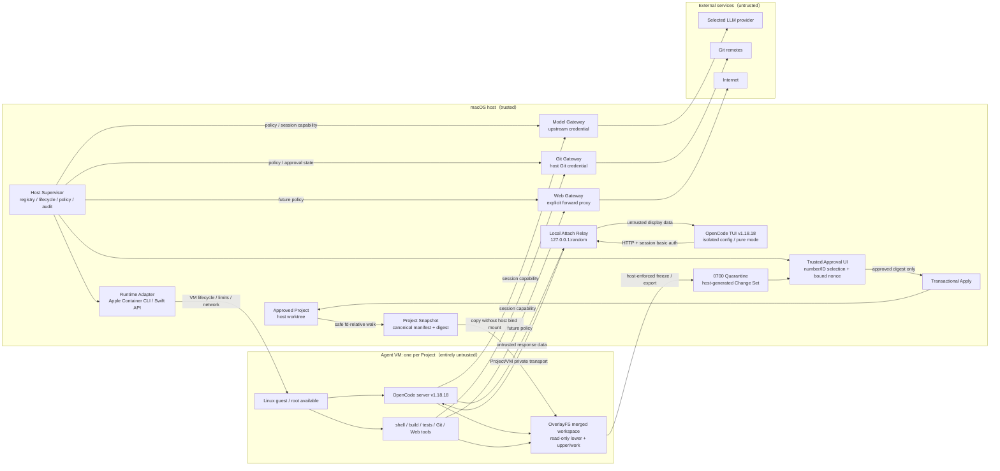
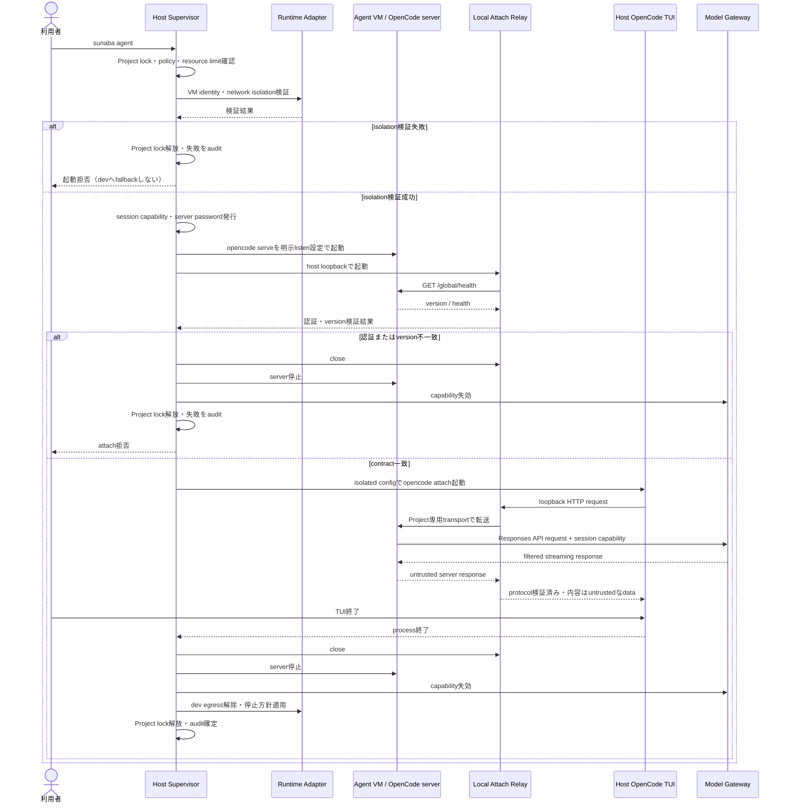
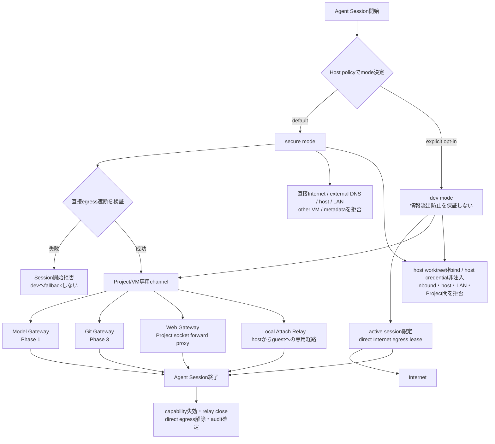

# sunaba macOS / Apple Container セキュアエージェント実行基盤 設計・実装計画

## 0. 設計概要

本文書は、macOS 上で OpenCode を安全かつ実用的に動かす実行基盤 `sunaba` の、合意済みアーキテクチャと実装順序を定義する。

基本構成は次のとおりである。

- 1プロジェクトにつき1台の **Agent VM** を作る
- OpenCode server、シェル、ビルド、テスト、依存導入、任意コード実行を同じAgent VM内で行う
- ホスト側では同じバージョンのOpenCode TUI clientだけを起動し、Host Supervisorのlocal attach relayを介してVM内serverへ接続する
- Agent VM内は侵害済みである可能性を常に考慮する一方、VM内での操作は原則として制限しない
- ホスト、他プロジェクト、認証情報、外部ネットワークなどの境界を、ホスト側のSupervisorとGatewayで強制する
- Agent VMからホストの作業ツリーを直接書き込ませず、OverlayFSとChange Setを介して成果物を昇格する
- 通常利用では、エージェントがGateway専用ツールを意識せず、OpenCode、Git、Web系ツールの標準的な操作を使えるようにする

この設計を一言で表す原則は、**「内部での自由、境界での強制、標準ツールへの透過的仲介」**である。

### 0.1 文書の確定度

以下は合意済みであり、実装の基準とする。

- 単一種類のAgent VM
- 1プロジェクト1VM
- プロジェクト単位での状態保持と、迅速なクリーン再生成
- OverlayFSによるホスト作業ツリーとの分離
- secure / dev の2モード
- Model Gateway、Git Gateway、Web Gatewayという3つの論理的な境界
- secureモードにおける任意の直接外向き通信の禁止
- OpenCodeからModel Gatewayを透過的に利用する方式
- Git Gateway経由ではpushだけをホスト承認対象にする方式
- OpenCode v1系をserver/TUIで同一バージョンに固定する方式。初期固定バージョンは`v1.18.18`

Web GatewayはPhase 4の実通信計測に基づき、Project専用socketへ接続する明示的forward proxy方式を採用する。具体的な保証と非保証は14章を正とし、TLSを復号しないためHTTPS tunnel内部のmethodやuploadを識別できない点を情報流制御の限界として扱う。

---

## 1. プロダクトの目的

sunabaの目的は、AIエージェントを単に制限することではない。悪意あるプロンプトインジェクションや依存パッケージによってエージェントが侵害されることを想定しながらも、実装・検証に必要な自由度を可能な限り保つことである。

セキュリティと利便性には一般にトレードオフがある。sunabaでは、VM内の細かな操作を列挙して禁止するのではなく、影響範囲をプロジェクト用VMへ閉じ込め、外部との境界だけを強く管理することで、次の両立を目指す。

- エージェントは通常の開発環境と同様にシェル、ファイル、コンパイラ、テスト、Git、Web系ツールを利用できる
- エージェントが完全に侵害されても、ホストや他プロジェクトへ直接影響を広げられない
- 実APIキー、Git認証情報、ホストの秘密情報をVMへ渡さない
- VM内の変更を、検査・承認可能な成果物としてホストへ取り出せる
- 利用者が必要に応じて安全性と接続性の異なるモードを明示的に選択できる

---

## 2. ゴールと非ゴール

### 2.1 ゴール

1. Apple silicon搭載macOS上で、Appleの`container`を基盤としてAgent VMを起動する。
2. OpenCodeと、OpenCodeが実行するあらゆるプログラムをAgent VM内へ隔離する。
3. Agent VM内ではroot取得や任意コード実行を含む高い自由度を許容する。
4. Agent VMからホスト、他VM、LAN、認証情報へ到達できない境界を作る。
5. secureモードでは、許可されたGateway以外を経由する外部通信を禁止する。
6. ホストの作業ツリーを直接マウントせず、変更を明示的なChange Setとして取り出す。
7. 1つのプロジェクト環境を複数セッションで再利用でき、必要なら短時間でクリーン再生成できるようにする。
8. Model Gatewayで利用モデル、利用量、並行数、セッション有効期限をホスト側から制御する。
9. Git認証情報をVMへ渡さず、Git Gateway経由ではpushのみを人間の承認対象にする。
10. セキュリティ上重要な境界操作を監査可能にする。

### 2.2 非ゴール

- VM内で動くOpenCodeやコマンドを信頼済みにすること
- VM内のroot権限や、任意のツール・依存パッケージの導入を禁止すること
- VM内の全システムコールや全ファイル操作をホスト側で監査すること
- LLMへソースコードを送らずにコーディングエージェントを成立させること
- 初期実装であらゆるLLMプロバイダーへ対応すること
- 初期実装で汎用Web通信の完全なポリシーを決定すること
- VMエスケープやmacOS、Virtualization.framework、Apple Container自体の脆弱性を完全に排除すること
- 実行中の侵害済みVMを内部から修復して信頼済みに戻すこと

---

## 3. 合意済みの設計判断

| ID | 判断 | 理由 |
|---|---|---|
| SD-01 | VMの種類はAgent VMだけにする | エージェントとコード実行を同じ隔離境界に置き、自由度と効率を保つため |
| SD-02 | 1プロジェクトにつき1VMとする | セッションやタスクをまたいで開発状態とキャッシュを再利用するため |
| SD-03 | タスクごとにはVMを作らない | 起動コスト、状態移送、ツール制約を避けるため |
| SD-04 | VMは侵害済みになり得るものとして扱う | プロンプトインジェクション、悪意ある依存、任意コード実行を想定するため |
| SD-05 | VM内の操作を原則自由にし、境界で防御する | エージェントの能力を落とさずに被害範囲を限定するため |
| SD-06 | ホスト作業ツリーを直接書き込み可能にしない | 侵害時の改変、削除、シンボリックリンク攻撃をホストへ直結させないため |
| SD-07 | 読み取り専用Project SnapshotをlowerとするOverlayFSをVM内に作る | 自由な編集と、ホストから分離された差分管理を両立するため |
| SD-08 | 成果物はfreeze/export後にホストがChange Set化する | guestのupperや自己申告したdiffを信頼しないため |
| SD-09 | secureを既定、devを明示選択とする | 安全な既定値を保ちつつ、直接インターネットが必要な開発も許容するため |
| SD-10 | secureからdevへ自動フォールバックしない | 通信制御の失敗を利便性のために見逃さないため |
| SD-11 | Gatewayはホスト側に置く | 実認証情報とポリシーを侵害可能なVMから隔離するため |
| SD-12 | GatewayはModel、Git、Webの3種類とする | 信頼境界と承認単位が異なる通信を分離するため |
| SD-13 | 標準ツールを透過的に仲介する | エージェントへsunaba固有ツールの学習を強制しないため |
| SD-14 | 初期Model GatewayはOpenAI Responses互換の最小実装とする | OpenCodeからCodex系モデルを利用する最短経路を作るため |
| SD-15 | CLIProxyAPIは挙動の参考資料としてのみ使う | 必要範囲を理解しつつ、広い機能面とTCBをそのまま持ち込まないため |
| SD-16 | Git Gatewayはclone/fetch/pullを許可し、pushだけを都度承認する | 通常の開発効率と外部への書き込み統制を両立するため |
| SD-17 | Web GatewayはProject専用forward proxyとする | 実OpenCode、curl、wget、aptがproxyを利用でき、TLS MITMなしでclient証明書検証を維持できるため。HTTPS内部の操作はorigin policyとquotaで限定する |
| SD-18 | VMは停止・再開でき、別操作としてクリーン再生成できる | 利便性と侵害からの復旧を分けて扱うため |
| SD-19 | OpenCode serverはAgent VM、TUI clientはホストで動かす | エージェント実行を隔離しながら、利用者へ通常のTUI操作を提供するため |
| SD-20 | OpenCode server/TUIを同じv1系のexact versionへlockする | client/server protocolと設定schemaのずれを防ぎ、利用者が明示更新するまで再現可能にするため |
| SD-21 | sunabaの承認はOpenCode TUI内で完結させない | 侵害済みVMによる偽承認画面とtrusted UIを分離するため |
| SD-22 | Web Gatewayは組み込み`common-development` origin presetとProject固有追加ruleを分離する | 一般的な依存導入を容易にしつつ、preset不使用とProject単位の追加を明示選択でき、更新をpolicy適用時に固定するため |
| SD-23 | 通常操作はbundled OpenTUI helperによる英語TUIへ集約し、Go側を唯一のauthorityとする | コマンド暗記を減らしつつ、UI processへpolicy判断やhost mutationを移さないため |
| SD-24 | OpenAI credentialはhost-only private fileへ保存し、認証方式はsunaba global設定とする | Keychain password promptをなくし、Projectごとの反復選択を避けるため。同一macOS userの別processから読まれ得る残余リスクは受容する |
| SD-25 | Setupで確認する推奨設定はsecure、OAuth、`common-development` Web accessとする | 利用者の一括確認後だけ、安全な通常開発に必要な既定経路を有効にするため |

---

## 4. 用語

| 用語 | 定義 |
|---|---|
| Project | sunabaが隔離とライフサイクルを管理する開発単位 |
| Agent VM | 1つのProjectに対応し、OpenCode server、workspace、任意コード実行を収容するApple Container VM |
| Agent Session | Gateway capabilityを発行し、VM内OpenCode serverとホストTUIを接続してから、server、relay、capabilityを終了するまでの論理セッション。VMの寿命とは異なる |
| Host Supervisor | Project、VM、Snapshot、Gateway、承認、監査を管理するホスト側sunabaプロセス |
| Host TUI | ホストで動く固定バージョンのOpenCode TUI client。agent runtimeやprovider credentialは持たない |
| sunaba TUI | 引数なしの`sunaba`から起動するbundled OpenTUI UI。Go authorityから受け取ったbounded viewを表示し、選択actionを返すだけで、Project file、credential、VM、Gatewayを直接操作しない |
| Local Attach Relay | ホストloopbackでTUIからの接続を受け、Project/VM専用transportを通じてVM内OpenCode serverへ転送するSupervisor管理relay |
| Trusted Approval UI | guest由来の表示と区別でき、pushやChange Set applyをホスト側だけで確定する操作面 |
| Runtime Adapter | Apple ContainerのCLIまたはSwift APIを安全なsunaba内部インターフェースへ変換する薄い層 |
| Gateway | Agent VMと外部サービスの間で、認証・ポリシー・監査を強制するホスト側サービス |
| Project Snapshot | VMの作成またはクリーン再生成時点の、ホスト承認済みプロジェクトを固定した読み取り専用基準 |
| Workspace Overlay | Project Snapshotをlower、Project専用領域をupper/workとするVM内OverlayFSのmerged view |
| Change Set | 固定baselineとexport済みmerged workspaceをホスト側で比較して作る、検査・承認可能な変更集合 |
| Clean Recreation | 現在のVMと書き込み層を破棄し、承認済みProject Snapshotから新しいVMを作る操作 |
| Transparent Mediation | 標準的なOpenCode、Git、Webツールの操作を保ったまま、通信経路だけをGatewayへ接続する方式 |

「透過的」とはGatewayの存在を秘密にするという意味ではない。VM内rootは設定や接続先を観測・模倣できる。重要なのは、エージェントが専用のGatewayツールを呼ぶ必要がなく、かつ実認証情報と最終的な許可判断がVM外にあることである。

---

## 5. 脅威モデル

### 5.1 信頼するもの

- macOSホストと利用者アカウント
- Apple silicon、Virtualization.framework、採用・固定したApple Containerのバージョン
- Host SupervisorとRuntime Adapter
- ホスト側Gateway、Secret Store、Local Attach Relay、Trusted Approval UI、監査ログ
- 公式artifactとdigestを固定したホスト側OpenCode TUI binaryと、exact dependencyからbuildしてdigestを固定したbundled `sunaba-ui`
- 承認を行う人間

### 5.2 信頼しないもの

- Agent VM全体。rootを含む
- Agent VM内のOpenCode server、設定、プラグイン、hooks、MCPや関連プロセス
- Host TUIがserverから受け取るmessage、diff、file名、terminal表示用データ
- Project内のソース、スクリプト、AGENTS.md、生成物
- インストールされた依存パッケージ、コンパイラ、テスト、ビルド成果物
- Web、Git、LLM、issue、ドキュメントから取得した外部コンテンツ
- Agent VMが生成したdiff、manifest、ログ、ファイル名、シンボリックリンク

### 5.3 想定する攻撃

- 外部文書やリポジトリに埋め込まれたプロンプトインジェクションにより、エージェントが完全に乗っ取られる
- VM内にマルウェアがインストールされ、root権限で実行・常駐する
- OpenCodeとは別のプロセスがGatewayの接続設定やセッショントークンを読み取り、OpenCodeを模倣する
- 秘密情報、ソースコード、生成物を外部へ送信しようとする
- ホスト作業ツリー、他Project、ホストサービス、LAN機器へ到達しようとする
- API利用量、CPU、メモリ、ディスク、プロセス数を浪費する
- Change Setに危険なシンボリックリンク、特殊ファイル、巨大ファイル、パストラバーサル相当の構造を混ぜる
- push対象を承認後に差し替える、force pushやref削除を通常pushに見せる
- セッション終了後もバックグラウンドプロセスがGatewayを利用し続ける
- Agent VMが偽の承認画面、ANSI/OSC制御文字、悪意あるfile名を表示して利用者やhost terminalへ作用する
- Project内の設定やpluginをホスト側OpenCode TUIへ読み込ませ、ホスト上で実行させる
- archiveやcopy/exportのsymlink、hardlink、特殊fileを利用してquarantine外へ書き込む
- 同じhost Projectを重複登録し、snapshot、export、applyを競合させる

### 5.4 保護対象

- ホストのファイルシステムと作業ツリー
- host-only認証情報file、Keychain、SSH鍵、Git/LLM認証情報、agent socket、環境変数
- 他のProject、VM、そのキャッシュと成果物
- ホスト上の一般サービス、LAN、private/link-local/metadata相当の宛先
- 外部Gitリポジトリと、利用者名義で行われる書き込み
- LLM利用枠、料金、Gateway資源
- ポリシー、承認記録、監査ログ
- ホストterminal、clipboard、Trusted Approval UIと、その入力経路

### 5.5 許容する開示

利用者が選択したLLMプロバイダーへ、モデル入力としてソースコードや作業内容が送信されることは許容する。コーディングエージェントの性質上必要な開示であり、Model Gatewayの許可された用途として扱う。

これは、任意の外部宛先への送信を許容するという意味ではない。Model Gatewayは利用者がホスト側で設定したプロバイダー、モデル、上限だけを利用する。

---

## 6. セキュリティ不変条件

実装は少なくとも次を常に満たさなければならない。

1. VM内に実LLM APIキー、Git token、SSH秘密鍵を置かない。
2. ホスト作業ツリーをAgent VMへ書き込み可能bind mountしない。
3. secureモードのAgent VMは、明示されたGateway経路以外で任意の外部宛先へ到達できない。
4. secureモードの通信制御を構成・検証できない場合は起動に失敗し、devへ切り替えない。
5. ProjectのVM、書き込み層、Gateway capabilityを他Projectと共有しない。
6. Gatewayは「OpenCodeプロセスだから安全」と判断しない。Agent VM内の任意プロセスが呼び出せる前提で制限する。
7. Gateway capabilityはProject、VMインスタンス、Agent Session、用途、有効期限へ束縛する。
8. セッション終了時にGateway capabilityを失効させる。
9. Change Setはホストがbaselineとexport結果から計算し、VM提供のdiffを信頼しない。
10. Change Setのホスト適用は明示的な承認後だけに行う。
11. Git pushはsecure/devを問わず、ホスト認証情報を使う限り都度承認する。
12. ホストのbaselineが変化していた場合、初期実装は自動マージせず競合として拒否する。
13. 監査ログはVMから変更・削除できないホスト側へ保存する。
14. CPU、メモリ、ディスク、プロセス数、Gateway利用量をホスト境界で制限する。
15. devモードの直接外向き通信もAgent Sessionの寿命へ束縛し、セッション終了後に残さない。
16. OpenCode serverとHost TUIはhost-only version lockが示す同じv1系exact versionを使用し、不一致ならattachしない。
17. Host TUIはhost Projectの設定、`.opencode`、plugin、hook、provider credentialを読み込まず、VM内serverだけへattachする。
18. OpenCode serverはpublic、LAN、host一般interfaceへ公開せず、認証付きのProject専用relay経路からだけ接続する。
19. pushとChange Set applyの承認はguest表示から分離したTrusted Approval UIで確定し、guest requestだけでは成立させない。
20. Snapshotの取得、guestからのexport、hostへのapplyでは、root外path、symlink追跡、hardlink、特殊fileによる境界越えをmaterialize前または同時に拒否する。
21. `.git`とsunaba管理領域をChange Setでhostへ適用しない。
22. canonicalなhost Project rootを一意に登録し、snapshot、export、apply、recreateをProject lockで直列化する。
23. Gateway capabilityはbearer tokenだけでなく、Project/VM専用transport上のpeer identityへ束縛する。
24. `sunaba-ui`はProject、credential、policy、Change Set materialization、VM socketを直接開かず、Go authorityが許可したversion付きbounded protocolのactionだけを返す。
25. OpenAI credential fileとglobal設定はProject、Snapshot、VM、Change Set、Host/OpenCode TUI、監査へcopyまたはmountしない。

---

## 7. 全体アーキテクチャ



Agent VMはエージェントとコード実行環境の両方である。VM内部のshell/file/build操作はHost Supervisorを経由しない。利用者がhost CLIから明示的に開始するsanitized line shellと単発`exec`だけはSupervisorがbounded guest execへ変換する。Host Supervisorが仲介・監査するのは、VMライフサイクル、これらの明示的なhost CLI操作、TUI attach、外部通信、認証、成果物の搬出、ホスト適用などの境界操作である。

Host TUIは利便性のためホストで動かすため、固定・検証されたtrusted dependencyとしてTCBへ入る。ただしserverから受け取る表示データは常にuntrustedであり、sunabaの承認経路としては使わない。

---

## 8. ProjectとAgent VMのライフサイクル

### 8.1 作成

1. 利用者がホストのProjectをsunabaへ登録する。
2. Supervisorはsymlinkを解決したcanonical rootとfilesystem identityを確認し、同じrootの重複登録を拒否する。
3. SupervisorはProject ID、Project lock、ポリシーを作る。
4. host側で安全にwalkした承認済み状態からProject Snapshotを作り、canonical manifestとdigestを記録する。
5. Project専用のVM、upper/work領域、キャッシュ領域を作る。
6. Agent VM内でlowerを読み取り専用、upper/workをProject専用としてOverlayFSを構成する。
7. merged workspaceをOpenCode serverの作業ディレクトリにする。

Project VM作成時にはProject IDと別のVM IDを発行し、container名、runtime root、workspace、ownership label、live guardをそのVM IDへ固定する。Agent Session IDをVM名や不変なVM policy digestへ含めない。

### 8.2 セッション開始

1. SupervisorがProject lockを取得し、VMと構成の同一性、ネットワークモード、resource limitsを確認する。
2. secureモードでは任意の直接外向き通信が遮断されていることを検査する。
3. 開始ごとに新しいAgent Session ID、Gateway capability、OpenCode server password、attach relay identity、絶対TTLを発行する。終了済みまたは期限切れSessionのIDと資格情報を再利用しない。
4. Model Gatewayの接続先と短命tokenをVM内OpenCode serverのセッション環境へ注入する。
5. VM内で固定バージョンの`opencode serve`を起動する。`--hostname`、`--port`、`--mdns=false`をSupervisorが明示し、guest loopbackまたはProject専用interfaceだけでlistenする。v1.18.18には`--no-mdns` flagが存在しないため使用しない。
6. Local Attach Relayをhost loopbackのrandom portで起動し、Project/VM専用transportでserverへ接続する。
7. `/global/health`でserver versionがHost TUIと完全一致することを検証する。不一致なら終了する。
8. host Project外のsunaba管理directoryをcwd/HOME/config rootにした、固定バージョンの`opencode attach`を`--pure`で起動する。

OpenCodeの設定情報や短命tokenはVM内プロセスから観測可能である。したがって秘密としてではなく、範囲と寿命を限定したcapabilityとして扱う。

同じVMで次のAgent Sessionを開始するときは、保存済みのcurrent policyをhost-only stateから再読込する。Model/Git/Web、session TTL/idle、quota、blocklist等のSession authorityは新しいSessionへだけ反映し、実行中Sessionのhandler、token、allowlist、quota、期限を差し替えない。mode、dependency/image、resource、Snapshot/export/Protected Path等のVM-bound policyがVM作成時から変わっていればresumeをfail closedで拒否し、export後のclean recreationを案内する。

起動待ちを抑えるため、固定Host TUIのdigest/version検証はVM再開と並列に実行してよい。ただし検証済み実行ファイルのidentityをTUI起動直前に再確認し、検証後の置換や変更を拒否する。Local Attach Relay経由のhealth確認は短いbounded backoffで行い、複数秒固定のpoll間隔を設けない。VM再開時の短命入力はmode `0700`の単一directoryへまとめて1回のcopyで復元し、guest service起動とresource probeは同じbounded exec transactionで行ってよい。並列化、copy/exec集約、poll短縮を理由に、VM identity、network、resource limit、Host TUI digest/version、server health/versionの検証を省略しない。

### 8.3 継続利用

- 同じProjectの次回セッションは、原則として同じVMとupperを再利用する。
- `stop` / `start` は状態を保持する通常操作である。
- ProjectごとにVMを分離し、異なるProjectへ転用しない。
- VM内の侵害はセッションをまたいで残り得る。この永続性は利便性との明示的なトレードオフである。

### 8.4 セッション終了

1. Host TUIを終了する。
2. Local Attach Relayを閉じ、VM内OpenCode serverを停止する。
3. OpenCode server password、Gateway capability、永続lease、各Gateway handlerを即時かつ不可逆に失効させる。listenerを閉じ、同じSessionをactiveへ戻さない。
4. devモードでは直接外向き通信を無効化するか、無効化を確認してからVMを停止する。
5. セッション後のバックグラウンドプロセスによるGateway操作を拒否し、直接インターネットへも到達できないことを保証する。
6. Project lockはProject VMを管理するSupervisorが保持する。VMはポリシーに応じて停止またはネットワークなしで稼働継続するが、active session用capabilityは保持しない。次の`agent`、`console`/`shell`またはsecure modeの`exec`は同じVM/upperに対して新しいAgent Sessionを開始する。

host CLIの`exec`はcommandと各argumentを別々のJSON fieldとしてSupervisorへ渡し、host shellへ再解釈させない。Supervisorは固定したguest wrapperとargvをApple Containerのexec境界へ直接渡し、stdout、stderr、exit code、timeout、各streamのtruncationを分離したbounded resultとして返す。cwdはProject workspaceからの正規化済み相対pathだけを受理する。対話TTY、raw `container exec`、host command実行へのfallbackは行わない。dev modeでは既存のforeground shell/agent以外に直接egress可能な入口を増やさず、`exec`を拒否する。

dev foreground終了時にExternal Git guardが作業損失を検出した場合は、自動破棄へ進まない。Supervisorはdirect egressをquiesceし、relay、Gateway handler、lease、server passwordを失効し、VMを停止して専用networkとpf stateを削除する。その後、Project/VM ID、停止VMのownership label、固定runtime root、baseline、export policy digestをhost-onlyなrecovery recordへ束縛し、停止VMだけを明示的な復旧資産として保持する。recovery record保存または後処理が失敗しても、それをVM破棄の許可として扱わない。

recovery状態は`status`で回収方法とともに表示し、通常のorphan cleanupは完全一致する停止VMを削除しない。`changes export`は同じVMをdeny-all network上で一時的に再所有してguardを再評価し、成功時だけChange Set化してVMを削除する。External Git状態を捨ててmain workspaceだけをexportする場合は`changes export --discard-external-git`、VM全体を捨てる場合は`recreate --discard-pending`または`destroy --yes --discard-pending`という明示操作を要求する。record、Project root、runtime path、VM labelのいずれかが一致しなければ回収も破棄も拒否する。

secureモードではattach閉鎖とcapability失効を先に完了してから、signal forwardingとchild reapを行うApple Containerの固定init経由でSIGTERMを送り、1秒のbounded graceで停止し、停止状態を再確認する。正常系はinitがSIGTERMへ応答して速やかに終了させ、1秒を常時消費しない。既定の長いgraceを対話終了ごとに待たない一方、通常停止を省略して直接killする経路には変更しない。

Agent Sessionの正常系とfail-closed経路は次のとおりである。



### 8.5 クリーン再生成

クリーン再生成は通常の再起動とは異なる回復操作である。

1. 未昇格の変更がある場合、利用者の選択によりmerged workspaceをquarantineへexportする。
2. exportはChange Set候補として保持できるが、新しいVMへ自動importしない。
3. 既存VM、upper/work、セッションcapabilityをProject IDとVM IDを照合して破棄する。
4. 現在のホスト承認済みProject Snapshotから新しいAgent VMを作る。
5. 新しい短命capabilityでセッションを開始する。

これにより、悪意ある永続化を新VMへ無意識に引き継がない。quarantineされた変更は、通常のChange Setと同じ検査・承認を経た後にのみ利用する。

---

## 9. Workspace、OverlayFS、Change Set

### 9.1 レイヤー構成

```mermaid
flowchart LR
    Worktree["Host approved Project"] --> Walker["Safe snapshot walker<br/>fd-relative / no symlink follow"]
    Walker --> Baseline["Canonical manifest<br/>baseline digest"]
    Walker --> Snapshot["Fixed Project Snapshot"]

    subgraph VM["Agent VM（untrusted）"]
        Lower["Read-only lower<br/>host-enforced or verified"]
        Upper["Project-local upper/work"]
        Merged["OverlayFS merged workspace"]
        Agent["OpenCode / arbitrary root process"]
        Lower --> Merged
        Upper --> Merged
        Agent -->|free edit| Merged
    end

    Snapshot -->|copy without host bind mount| Lower
    Merged --> Freeze["Host-enforced freeze<br/>VM stop or atomic snapshot"]
    Freeze --> Readout["Frozen runtime readout<br/>reconstruct merged semantics"]
    Readout --> Validate{"Safe extractor<br/>path / type / size / link validation"}
    Validate -->|invalid| Reject["Reject + audit<br/>no host worktree write"]
    Validate -->|valid| Quarantine["0700 Quarantine<br/>canonical manifest"]
    Baseline --> Compare["Host-side comparison"]
    Quarantine --> Compare
    Compare --> ChangeSet["Change Set<br/>add / modify / delete / rename"]
    ChangeSet --> Approval{"Trusted approval<br/>nonce + digest + paths"}
    Approval -->|reject| Retain["Retain or discard quarantine"]
    Approval -->|approve| Transaction["Journaled transactional apply<br/>nofollow / fsync / rename / rollback"]
    Transaction --> Worktree
```



- lowerは固定されたProject Snapshotであり、セッション中にホスト作業ツリーと同期しない。host側に保持したcanonical manifestがbaselineの権威であり、guest内のlowerやdigestを信頼しない。read-only性はguest内のpermissionやmount optionだけに依存せず、host/runtime側のimmutable storageまたは改変検知で強制する。
- upper/workはAgent VMまたはProject専用の隔離領域に置く。
- merged viewでは、エージェントは通常の書き込み、削除、rename、symlink作成を行える。
- OverlayFSのwhiteoutや内部表現を、そのままホスト適用フォーマットにしない。
- host worktreeをlowerとして直接参照する構成も採用しない。snapshot時点を固定し、TOCTOUを避ける。

### 9.2 Snapshotの取得と対象範囲

SnapshotはcanonicalなProject rootをdirectory descriptorとして開き、そこから相対的にwalkして作る。symlinkはリンク自体を記録し、リンク先を辿ってProject root外を読み取らない。通常file以外、path depth、file数、個別size、総sizeにも上限を設ける。

Snapshotへ含める対象はhost側Project policyで決め、Project内のfileがそのpolicyを広げられないようにする。

`project.json`の`snapshot.exclude`はhost-onlyなroot-relative literal pathの集合とし、該当path以下をSnapshot対象から外す。Project内の`.gitignore`を暗黙のセキュリティ境界には使わない。利用者が明示的にimportした場合だけ、negationやglobを含まないliteral entryを除外候補へ取り込み、`config apply`前にhost-only設定として確認する。

各VM作成前にSnapshot previewを生成し、entry/file数、総size、boundedな大容量file一覧、秘密らしいfile名だけを内容を表示せず提示する。利用者はpreviewのexact manifest digestをhost側で承認し、VM作成時は同じpolicy digestかつ同じmanifest digestでなければ拒否する。`project init`は登録とhost-only設定の作成だけを行い、未使用のSnapshotを作らない。

- source、`opencode.json`、`.opencode/`、`.gitignore`、`.gitmodules`は通常のProject fileとして含められる。Project固有のOpenCode設定やpluginはVM内serverだけが読み込む
- `.git/`はhostのcredential、hook、config、管理状態を含み得るためSnapshotへcopyしない
- Phase 1ではVM内でsyntheticなbaseline commitを持つguest-local repositoryを作る。Phase 3で履歴が必要になったら、Git Gateway経由のclone/fetchまたはcredentialとhookを含まない検証済みbundleを使う
- `.git/`、sunaba管理metadata、host TUIのconfig/dataはguest-localまたはhost-onlyなProtected Pathとし、Change Setへ含めない
- `.env`、秘密鍵、証明書等のProject内機密を含める場合、それらも利用者が許可したLLMへ送られ得る。初回Snapshotで警告し、host側のinclude/exclude policyで除外できるようにする

canonical manifestは、正規化済み相対path、file type、mode、size、content SHA-256、symlink targetなどから決定的に生成し、そのmanifest自体のSHA-256をbaseline digestとする。xattrを対応対象にするまでは破棄するか拒否するかをpolicyで固定する。

### 9.3 Export

成果物を取り出すときは、次の順序を守る。

1. 対象workspaceへの書き込みをhost境界でfreezeする。guest内のsignal、lock、OpenCode終了だけを信頼せず、Agent VMの停止またはRuntimeが保証するatomic snapshotを使う。
2. frozen root filesystem、upper/lower、またはRuntime snapshotからmerged viewを再現し、host上のmode `0700`のProject専用quarantine directoryへentry streamとしてmaterializeする。停止後にmerged mountが失われる場合のwhiteout、opaque directory、rename semanticsもhost側で正しく再現する。
3. host側safe extractorが各entryを作成する前に、正規化path、Protected Path、型、size、symlink、hardlink、特殊fileを検証する。検証前に通常のarchive extractorやhost worktreeへ展開しない。
4. Apple Containerの`container export`、`container cp`または公開APIを使う場合は、停止済みVMまたはimmutable snapshotから読み出せること、必要なmerged semanticsを保つこと、quarantine外へ書き込まないこと、symlink/hardlink処理がattack testで証明できた場合に限る。証明できなければ採用せず、DG-02を未達とする。
5. quarantineはdataとしてだけ扱い、binary、hook、plugin、script、file preview helperを実行しない。
6. Supervisorが記録済みbaselineとquarantineのcanonical manifestを比較し、Change Setを生成する。
7. 利用者または後続の検査処理へ、制御文字をescapeしたChange Setを提示する。
8. 承認されたChange Setだけをホスト作業ツリーへ適用する。

pending Change Setは、host-onlyなProject stateのmode `0700`領域へ、検証済みbaseline Snapshot、検証済みMerged View、両manifest、Change Set、作成時の正規化済みSnapshot/export policyとそのdigestを自己完結した組として保存する。保存した両Snapshot、policy、Change Setのdigestを再検証できた場合だけpendingを確定し、容量不足や保存失敗ではAgent VMを破棄しない。pending確定に失敗した場合はsecure/devのどちらでも、停止VM、固定runtime root、検証済みMerged ViewのdigestをProject-boundなhost-only recovery recordへ束縛し、`changes export`が同じfrozen成果物のpending確定を再試行できるようにする。通常cleanupはrecord保存失敗を削除許可とせず、guardlessな停止VMをfail closedで拒否する。これによりexport後にhost worktreeや無関係なcurrent Project policyが変化しても、作成時のpolicyで変更前後の内容をreview/applyできる。ただしhost baselineが変化したpendingのapplyは9.5のとおり拒否する。

内容確認はhost側の`changes review`で行う。reviewはread-onlyであり、保存済みbaselineとMerged Viewをfd-relativeかつsymlink非追跡で再検証し、Change Set digestへ対応する追加、変更、削除、rename、type、mode、実行属性、symlink target、text差分を表示する。差分生成と表示ではProjectのGit設定、外部`diff`、pager、editor、syntax highlighter、MIME判定、preview helper、scriptを起動しない。text判定、1 file、総入力、行長、行数、diff出力へhost固定の上限を設け、binary、invalid UTF-8、巨大file等の内容を表示できない場合はsize、SHA-256、modeと未表示理由を明示する。path、symlink target、diff本文を含むすべてのuntrusted表示はterminal sanitizerを通す。

### 9.4 Change Setの検証と適用

最低限、次を検査する。

- 相対パスの正規化とProject root外への脱出
- symlinkのリンク先と、symlinkを経由した書き込み
- device、socket、FIFOなど通常ファイル以外の型
- ファイル数、個別サイズ、総サイズ
- mode bit、実行属性、必要ならxattr
- 追加、変更、削除、renameの再現性
- baseline digestと現在のホスト状態の一致
- `.git/`、sunaba管理metadata等のProtected Pathが含まれていないこと
- pathと表示文字列に含まれるANSI/OSC、改行、双方向文字等が承認UIで安全にescapeされること
- 保存済みbaselineとMerged Viewの実体がmanifestおよびChange Set digestと一致し、review中のfile差し替えを検出すること
- reviewで内容未表示となったbinary、巨大file、上限超過を黙って承認済みとして扱わず、対象metadataと未表示理由を明示すること

guestが提出するパッチや変更一覧は表示用の参考にはできるが、権威ある入力にしてはならない。

applyはProject lockを保持し、canonical Project rootのdirectory descriptorから相対的に行う。既存symlinkを辿らず、通常fileは同一directory内の一時fileへ書いて`fsync`後にrenameする。全操作を事前検証し、影響を受ける既存entryをhost側transaction領域へ退避してから変更する。削除とdirectory操作もroot外へ作用しないことを各操作時に再検証する。途中失敗やprocess crashではjournalからrollbackまたは明示的なrecoveryを行い、部分適用を成功扱いしない。

### 9.5 競合

baseline作成後にホスト作業ツリーが変化していた場合、MVPではChange Set適用を拒否する。自動rebase、自動merge、部分的なbest-effort適用は行わない。将来導入する場合も別の明示的な操作とする。

---

## 10. ネットワークモード

### 10.1 secureモード（既定）

secureモードでは、Agent VMからの任意の直接外向き通信を禁止する。

遮断対象はTCPだけではなく、IPv4/IPv6、UDP、QUIC、ICMP、raw socket、外部DNS resolverを含む。名前解決が必要なGatewayはhost側で行い、guestから任意のDNS queryを外部へ送れる経路を残さない。

許可し得る通信は、Host Supervisorが用意した専用経路上のGatewayだけである。これは必ずしも「VMにネットワークインターフェースが一切ない」ことを意味しない。要件は、次の宛先へGatewayを迂回して到達できないことである。

- 公開インターネット
- macOSホスト上の一般サービス
- LAN内の端末とルーター
- private、loopback転送、link-local、metadata相当の宛先
- 他のAgent VM
- Apple Containerの管理面

Gateway用経路の候補は、vsock相当のhost/guest transport、または外部へrouteされない専用host-only networkとlocal relayである。どちらがApple Containerの公開・安定APIで実現できるかはPhase 0で実証する。専用経路が作れても、ホスト一般サービスへ横移動できれば不合格である。

Host TUIからOpenCode serverへのattachはhostからguestへの別方向の経路である。Local Attach Relayだけをhost loopbackにbindし、guest serverをhost/LANへ直接公開しない。attach経路からGateway管理面やhost一般serviceへ到達できないようにする。

secureモードの初期vertical sliceでは、Model Gatewayだけを到達可能にしてよい。その段階では`apt update`、一般Web、Git remote操作が失敗することを仕様として明示する。

### 10.2 devモード（明示選択）

devモードでは、Agent VMからインターネットへの直接外向き通信を許可する。このモードでは、侵害されたVMから外部への情報流出をsunabaが防ぐという保証は提供しない。

直接外向き通信を許可するのはactiveなAgent Session中だけとする。セッション終了時には接続を閉じ、新しいセッション開始時にモードを再確認して構成する。これはセッション中の情報流出を防ぐものではないが、状態保持されたVM内のマルウェアが利用者不在時に通信し続ける時間を限定する。

export拒否後に保持するdev recovery VMはactive sessionではない。VMは停止し、専用network、pf state、Gateway capability、attach経路を持たない。後続exportのために一時起動する場合も、同じidentityの専用networkをVM停止中に再作成し、deny-allを適用してから起動する。

ただし、devモードでも次は維持する。

- VMによるホスト隔離
- host worktreeの非bindとChange Set境界
- ホスト認証情報の非注入
- Project間分離
- resource limits
- Git Gatewayでホスト認証情報を使うpushの承認
- inbound、LANアクセス、host port公開の既定拒否。必要時は別の明示設定とする

UIと監査ログにはdevモードであること、情報流出防止を保証しないことを目立つ形で表示する。

devモードでは任意の直接通信を許すため、VMが自分で取得・生成したcredentialや認証不要のendpointを使うGit pushまで、Git Gatewayの承認で強制的に止めることはできない。sunabaが確実に管理するのはホストcredentialを利用するGit Gateway経由のpushである。すべての外向きGit書き込みを承認対象にする要件は、devモードの直接通信許可と両立しない。

実装方式はProject/VM専用のApple Container NAT networkと、割り当てられたsource IPv4/IPv6 subnetへ束縛したpf anchorを採用する。default networkを共有せず、networkの完全名、owner/project/VM/mode label、NAT plugin、subnet/gatewayを開始前に再検証する。pfはDNS/DHCPとpublic egressのstateだけを許可し、host/self、RFC1918、CGNAT、link-local、metadata相当、documentation/benchmark、multicast、他VM private subnet、unsolicited inboundを拒否する。実装は同時active dev sessionをhost flockで1つへ制限し、VM削除後にanchorと専用networkを失効する。secure modeはこのpfへ依存せず`network none`を維持する。

### 10.3 モード遷移

- secureが既定である。
- devはProjectまたはセッションで明示的に選択する。
- secureの構築・検証に失敗した場合、起動を失敗させる。
- 実行中に黙ってモードを変えない。
- モード変更時は既存セッションcapabilityを失効し、ネットワーク状態を再構成・再検証する。

secure/devの通信経路と共通して維持する境界は次のとおりである。



---

## 11. Gateway共通設計

### 11.1 3つの論理Gateway

| Gateway | 主目的 | ホスト側で守るもの | 初期状態 |
|---|---|---|---|
| Model Gateway | OpenCodeからLLMを利用 | 実API key/OAuth token、provider/model、利用量 | 最初に実装 |
| Git Gateway | 標準Git操作をremoteへ中継 | Git token/SSH鍵、push承認 | Model後に実装 |
| Web Gateway | Web検索・取得・package readを明示proxyで仲介 | origin、解決後IP、quota、既知危険先 | HTTPS tunnel内部のmethod/uploadは非保証 |

パッケージ取得専用Gatewayは独立した確定コンポーネントにしない。secureモードで将来`apt`、言語package manager、curl等を使えるようにする場合は、Web Gatewayの要件として扱う。

### 11.2 透過的な利用

- OpenCodeは通常のprovider設定でModel Gatewayへ接続する。
- Gitは通常の`clone`、`fetch`、`pull`、`push`を使い、remote URLやremote helperを通じてGit Gatewayへ接続する。
- Webは将来、既存の`web_search`、`web_fetch`、curl、package managerをできるだけそのまま使える方式を選ぶ。
- エージェントへ「sunaba gateway tool」の明示呼び出しを要求しない。

### 11.3 capabilityと呼び出し主体

VMへ渡すのは実credentialではなく、短命のGateway capabilityである。capabilityは少なくとも次へ束縛する。

- Project ID
- VM instance ID
- Agent Session ID
- Gateway種別と許可操作
- 有効期限
- request、token、cost、bandwidth、concurrency等の上限
- Project/VM専用channelのpeer identity

ただし、同じVM内の悪意あるプログラムはOpenCodeの設定を読み、同じcapabilityで呼び出しを模倣できる。プロセス名やUser-Agentを認証根拠にしてはならない。被害はGatewayの許可範囲、quota、rate limit、セッション寿命、監査、失効によって限定する。

監視だけでは強制にならない。利用上限や送信先制限は、Gatewayがリクエストを拒否する形で実施する。

bearer token単独、source IP、process名、User-AgentだけでVM identityを判断してはならない。Gateway endpointはpublic/LAN interfaceへbindせず、Projectごとのvsock、Unix socket relay、または同等の専用channelからだけ受け付ける。別Project、host一般process、外部端末から同じtokenを提示しても拒否する。

Gateway data planeはSupervisorの管理面から分離し、最小権限のprocessとして動かす。Model GatewayはProject fileを読む権限を持たず、管理API、Secret Store操作、任意upstream指定をguestへ公開しない。入力parser、stream、header、body、connection数へ上限を設け、guest requestをhost TCBへのuntrusted inputとして扱う。

---

## 12. OpenCode v1とModel Gateway

### 12.1 OpenCode v1の固定

OpenCodeはv1系のexact releaseをhost-only version lockへ固定して使う。本文書更新時点（2026-08-13）のbootstrap固定値は`v1.18.18`である。bootstrap値は初回setupとlegacy migrationの出発点であり、利用者は明示的なversion設定と`update check` / `update apply`により別の検証済みv1 releaseへ更新できる。

| 用途 | 公式artifact | SHA-256 |
|---|---|---|
| host / Apple silicon TUI | `opencode-darwin-arm64.zip` | `7d668bf26496fec8686d4e51ebb1ac2bd2e393f0c1620aa696c4c242a9e5806a` |
| guest / Linux arm64 server | `opencode-linux-arm64.tar.gz` | `dcb1b5ec5687b43f87749560021f9203f3809e0ce5ae44ff9be8ae17083fe4ba` |

- release、artifact名、digestは公式GitHub Release APIから取得し、dependency manifestへ記録する
- download後、展開前と実行前にdigestを検証する
- 開発時のhost TUIはgitignore済みの`bin/tools/opencode/v1.18.18/`へ置き、global installを要求しない。製品配布方式は署名・更新設計と併せて決める
- guest serverは固定artifactをbase imageへ組み込み、image digestとOpenCode versionをpolicyへ記録する
- Agent Session開始時に`latest`を解決せず、OpenCode自身の自動updateとv2系への自動移行を使わない
- v1系の新releaseへ上げるときは、server/TUIの両artifactとdigestを同じ変更で更新し、provider config、attach API、terminal、integration testを通す
- Agent Session開始時にHost TUIの`opencode --version`とserverの`/global/health`を比較し、完全一致しなければattachしない

#### 12.1.1 Host-only version設定

利用者が編集するversion宣言は`${XDG_CONFIG_HOME:-$HOME/.config}/sunaba/versions.json`、sunabaが生成する適用済みlockは同directoryの`versions.lock.json`を正本とする。directoryはcurrent user所有のmode `0700`、両fileはmode `0600`の通常fileに限定し、symlink、unknown field、trailing data、oversizeを拒否する。Project、Snapshot、VM、Change Setへcopyまたはmountしない。

`versions.json`はOpenCodeについて次のいずれかだけを受け付ける。

- `exact`: 利用者が指定したv1系exact semantic version
- `channel`: 固定名`v1-stable`。明示的な`update check`時だけ公式releaseからexact v1 versionへ解決する

runtime、Project policy、Agent image buildは`versions.lock.json`に記録されたexact version、artifact URL、SHA-256、source tag/commit、Agent image identityだけを使う。`channel`、`latest`、rangeをAgent Session開始時の入力にしない。

#### 12.1.2 初回setup

fresh hostでは、TTYの引数なし`sunaba`がSetupを開き、CLIでは`sunaba setup`を明示実行できる。`project init`、`up`、`agent`、`console`/`shell`はsetup完了前にfail closedで拒否する。`help`、`setup`、`versions`、`update`、`credentials`は利用できる。

`setup`はbinaryへ埋め込んだbootstrap dependency contractから既定の`versions.json`を作り、macOSとApple Containerを検証する。exactなhost OpenCode artifactとbundled `sunaba-ui`をsunaba管理quarantineへ取得してdigestを検証し、guest artifactのSHA-256を検証してAgent imageをbuildする。利用者が既に導入したOpenCodeやglobal設定は参照・変更せず、Bun、Node.js、OpenTUI、OpenCodeのglobal installを要求しない。成功後だけmanaged artifact、`versions.lock.json`、host-only global active dependencyを原子的に確定する。初回から別versionを使う場合は`setup --config-only`の後に`versions set|track`、`update check`、`update apply`を使う。

既存global stateまたはProject stateがある場合はfresh setupとして上書きしない。legacy dependencyと既存Projectをinventoryし、同一bootstrap contractだと検証できる場合だけ明示的なmigrationを行う。VM、pending Change Set、Project fileを暗黙に削除しない。

#### 12.1.3 明示的update

version更新は`sunaba update check`と`sunaba update apply`の二段階に分ける。

`update check`は`versions.json`を検証し、exactまたは`v1-stable`をexact versionへ解決し、公式host/guest artifactとsource provenanceをhost quarantineへ取得してdigestを計算する。active lockやProject policyは変更せず、設定digest、current lock digest、target manifest、artifact digest、期限へ束縛したcandidate planをhost-only stateへ保存して表示する。

`update apply`は直前のcandidateだけを使い、`latest`を再解決しない。sunaba管理領域のhost OpenCodeと`sunaba-ui`のversion/executable digest、candidate artifact、Apple Container、既存VM/Supervisor、Project policy identityを再検証する。runningまたはpaused VMとunexported変更がある場合は拒否し、利用者へ`changes export`または明示破棄を要求する。host quarantineにあるpending Change Setは保持でき、更新後も通常の`changes apply`で処理できる。

applyはcandidate Agent imageをno-cache buildしてversionとidentityを検証した後、journaled transactionで全Projectのdependency binding、global active dependency、`versions.lock.json`を更新する。commit decision前はrollbackでき、commit decision後のcrashはsource/target以外のstateが混入していないことを確認してroll-forwardする。旧Agent imageと旧managed Host TUIはupdate transaction中に削除しない。

自動実行を許可し得るのはread-onlyな更新確認までとする。`update apply`とAgent Session開始時のversion変更は必ず利用者の明示操作とし、secureからdevへのfallbackと同様、利便性のためにversion検証を緩めない。

### 12.2 OpenCode serverとHost TUI

Agent VMでは`opencode serve`をVM内rootとしてmerged workspaceで動かす。sunaba生成設定はOpenCode v1のglobal `permission`を`allow`にし、bash、edit、外部directory、`.env`読取、doom-loopを含むtool操作をOpenCode内の追加承認なしで実行できるようにする。Projectの`opencode.json`、`.opencode/`、plugin、hook、MCP、AGENTS.md等はVM内serverだけが読み込み、VM内で自由に実行できる。serverは`OPENCODE_DISABLE_AUTOUPDATE=1`と`OPENCODE_DISABLE_MODELS_FETCH=1`を設定する。Model Gateway向けのmodel metadata、context/input/output上限、capabilityは、sunabaが認証方式ごとの固定catalogから生成するcustom provider設定を使う。secureモードでModels.dev、OpenAIのmodel discovery API、update endpointへの直接通信を前提にしない。

VM内rootとOpenCodeの`permission: allow`はVM外の権限を広げない。host Projectはbind mountせず、secure networkは`none`、Model/Git/Web Gatewayのallowlist・quota・Host Trusted Approval、Local Attach Relay認証、VM resource limit、停止export後のsafe parserを引き続き境界として強制する。VM内processやProject設定はuntrustedであり、root取得済みとして検証する。

Project設定はuntrustedであり、OpenCode v1では`server.hostname`、`server.port`、`server.mdns`、`server.cors`も設定できる。したがって、listen先とmDNSはSupervisorがCLI引数`--hostname`、`--port`、`--mdns=false`で上書きし、CORS設定の有無をnetwork boundaryや認証の根拠にしない。v1.18.18のboolean flagは`--mdns`であり`--no-mdns`は存在しない。Local Attach RelayはOpenCodeのCORS応答とは独立して、許可したTUI接続、HTTP method/path、basic auth、Project/VM channelだけを受け付ける。

serverは次を満たす。

- mDNSを無効にする
- Supervisor自身はCORS originを追加しない。Projectが追加しても到達範囲や認証が広がらない
- sessionごとに生成した高entropyの`OPENCODE_SERVER_PASSWORD`でHTTP basic authを有効にする
- guest loopbackまたはProject/VM専用interfaceだけでlistenし、public、LAN、host一般interfaceへ公開しない
- Host TUIとSupervisorのhealth checkはLocal Attach Relay経由だけで接続する
- server passwordは引数、log、監査eventへ出さず、session終了時にserver停止と同時に失効する

Host TUIは固定した公式macOS artifactをSupervisorが起動し、`opencode attach http://127.0.0.1:<random-port> --dir <guest-merged-workspace>`でLocal Attach Relayへ接続する。host側では次を強制する。

- cwd、HOME、XDG data/config、`OPENCODE_CONFIG`、`OPENCODE_CONFIG_DIR`、`OPENCODE_TUI_CONFIG`をProject worktree外のsession専用sunaba管理領域へ分離する
- `--pure`、`OPENCODE_DISABLE_PROJECT_CONFIG=1`、`OPENCODE_DISABLE_DEFAULT_PLUGINS=1`、`OPENCODE_DISABLE_AUTOUPDATE=1`、`OPENCODE_DISABLE_MODELS_FETCH=1`、`OPENCODE_DISABLE_LSP_DOWNLOAD=1`を使う
- `attach --dir`は指定pathがホストにも存在するとhost側で`chdir`するv1.18.18の挙動であるため、guest workspaceにはhost上に存在しないsession固有pathを使い、TUI起動直前にもhost側で不存在を確認する。Project config無効化はこの確認とは独立して常に行う
- host Projectの`opencode.json`、`.opencode/`、`.env`、plugin、hook、provider credentialを読み込まない
- Model Gateway tokenやupstream API keyをHost TUIへ渡さない
- remote serverから受け取るmessage、diff、file名をuntrusted表示データとして扱う

Host TUIはTCBに含まれるため、server応答によるcrash、任意file access、ANSI/OSC sequence、clipboard操作、外部editor起動をattack testする。必要な安全性をHost TUIだけで保証できない場合はSupervisor側relayで危険なeventを拒否し、`sunaba agent`を一般提供しない。

pushとChange Set applyの承認はOpenCode TUIへ表示された文字列やserver eventだけでは成立しない。SupervisorはProject、対象digest/object ID、host側で生成したnonceを内部で束縛し、Trusted Approval UIには利用者が判断する対象とactionを表示してhost側の明示操作で確定する。利用者へdigestやnonceを手入力させない。guestは承認requestを開始できるが、承認結果を生成・変更できない。

### 12.2.1 sunaba TUI

通常操作のsunaba TUIは`@opentui/core`からstandalone executableとしてbuildしたbundled `sunaba-ui`を使う。利用者へBun、Node.js、OpenTUIのinstallを要求しない。build時のOpenTUIとBunはexact versionへ固定し、`sunaba-ui` artifactのdigestをhost-only dependency lockへ含め、Go側が起動直前にowner、mode、regular file、architecture、digestを検証する。auto updateは行わず、既存の`update check`と`update apply`へ統合する。

Go側sunabaを唯一のauthorityとし、`sunaba-ui`はOS tempのowner-only directoryに作るProject/process専用Unix socket上のversion付きbounded JSON protocolだけで接続する。Go側はProject/VM/Session状態、policy、credential、Snapshot、Change Set、Gateway、apply、recovery、監査を所有し、sanitizedなview modelと現在許可する固定action IDだけを送る。helperはProject、credential、policy、Change Set materialization、VM socketを直接開かず、network、shell、browser、clipboard、通知、plugin、外部editorを起動しない。古いview revision、未知action、複数接続、unknown field、trailing data、oversize、timeoutを拒否する。

sunaba TUIとOpenCode TUIは同時に同じterminalを所有しない。Agent開始時はsunaba TUIがterminalをrestoreして終了した後にGo側がOpenCode TUIを起動し、OpenCode終了後にSession authorityを失効して新しいsunaba TUIを起動する。helperの終了、crash、signal、protocol違反ではterminalをrestoreし、未確定mutationを行わずfail closedに戻る。

### 12.3 Model providerと認証方式

利用者はsunaba global設定で`api_key`または`oauth`を選ぶ。`api_key`はOpenAI APIの従量課金credential、`oauth`はChatGPTのCodex subscription credentialを使う。Projectごとの認証方式は持たず、通常起動時に選択を繰り返さない。変更はSettingsまたはglobalな`sunaba model auth api-key|oauth`を明示実行した場合だけ行う。Agent Session開始時にglobal設定をsnapshotし、active Sessionは終了まで同じ方式を使う。登録済みの別方式へ自動fallbackしない。

LLMアクセスは、エージェントへ公開する明示的なtool callではない。OpenCode runtime自身がprovider通信としてModel Gatewayを呼び、エージェントは通常どおりモデル上で動作する。Agent VMからModel Gatewayのupstream設定や実credentialを参照・変更する経路は設けない。

実API keyとOAuth credentialは`${XDG_DATA_HOME:-$HOME/.local/share}/sunaba/credentials/openai.json`へ別fieldとして保存し、両方を同時に保持できる。OAuthはaccess token、refresh token、ID token、account ID、有効期限だけをbounded strict JSONへ保存する。directoryはcurrent user所有のmode `0700`、fileはcurrent user所有のmode `0600`のregular fileに限定し、canonical path、symlink、hardlink、owner、mode、sizeをopen前後に検証する。更新はowner-only lockで直列化し、同一directoryの新規fileへの完全書込、file `fsync`、atomic rename、directory `fsync`で行う。一方のcredential更新・削除で他方を変更しない。

Model Gatewayだけがglobal設定で選択されたcredentialを読む。secretをargv、environment、Project file、global設定、VM、Host/OpenCode TUI、log、error、監査へ載せない。API keyのTUI入力はmaskし、OAuth device flowとrefresh token rotationを含むread-modify-writeを同じfile lockで直列化する。Keychain、`/usr/bin/security`、Security.frameworkを使用せず、旧Keychain itemを読取、移行、自動削除しない。更新後は再認証を要求する。同じmacOS user権限の別processがprivate fileを読める残余リスクは受容し、Keychainまたは利用者passwordを使った暗号化を追加しない。

activeな認証方式だけは`${XDG_CONFIG_HOME:-$HOME/.config}/sunaba/settings.json`へsecretを含まないglobal設定として保存する。既定は`oauth`とする。OAuthとAPI keyの両方が登録済みでも、利用者が明示変更するまで方式を変えない。credential欠如、invalid、期限切れ、refresh失敗ではfail closedとし、別方式へ切り替えない。global方式とProject model allowlistが両立しない場合はSession開始前に対象modelと修正actionを示して拒否し、modelを暗黙に置換しない。

OAuthログインはCodex public clientのdevice authorization flowを使う。sunabaは固定したOpenAI auth endpointへだけ接続し、verification URLとuser codeをterminalへ表示する。ブラウザを自動起動せず、15分以内に得たauthorization codeをPKCE verifierと交換する。token refreshは有効期限直前にホスト側で直列化し、rotated refresh tokenを認証情報fileへ原子的に更新する。JWT claimはaccount IDの抽出にだけ使い、sunabaによるtoken検証や認可判断には使わない。upstreamがBearer token自体を検証する。

Agent VMへは次だけを渡す。

- VMから到達できるModel Gatewayのbase URL
- セッション限定のsunaba gateway token
- 許可されたprovider/modelを指すOpenCode設定

OpenCode側ではprovider ID `sunaba`、npm provider `@ai-sdk/openai`のcustom providerを使う。sunabaが生成する設定は`enabled_providers`を`sunaba`へ限定し、`options.baseURL`をModel Gatewayへ向け、`options.apiKey`には環境変数参照の短命gateway tokenを設定する。`models`にはProject policyの`allowed_models`だけを出力し、認証方式ごとの固定catalogからmodel family、reasoning/tool/attachment capability、modalities、context/input/output上限を設定する。API key用とOAuth用の定義は別に持ち、特にOpenCodeのcompaction開始点へ使われるinput上限をsubscriptionの実効上限に合わせる。設定ファイルやOpenCodeのcredential storeへ実upstream credentialを書かない。

Model GatewayはOpenAIへモデル一覧を問い合わせない。セッション開始時にProject policyの`allowed_models`が選択した認証方式のsunaba catalogにすべて存在することを検証し、その集合をGatewayとOpenCode設定へsnapshotする。先頭要素を既定modelとする。未知のmodelや別認証方式だけに存在するmodelが1件でもあればfail closedでセッションを開始しない。

`api_key`では`https://api.openai.com/v1/responses`へAPI keyを注入する。`oauth`では`https://chatgpt.com/backend-api/codex/responses`へ有効なaccess token、固定`ChatGPT-Account-Id`、固定`Originator`を注入し、Codex backendが受理しないAPI専用fieldを削除する。OAuthの上流仕様差はGatewayで吸収し、guestへOAuth tokenやaccount IDを返さない。

Project configや侵害済みserverが`baseURL`、provider、modelを変更すること自体は防御境界にしない。secure networkはModel Gateway以外への接続を許さず、Model Gatewayがhost policyのprovider/model allowlistを最終的に強制する。

### 12.4 Gatewayの責務

- OpenAI Responses互換の必要最小限のrequest/streaming responseを中継する
- 利用者が設定したupstream以外を選択させない
- Project policyからsnapshotした1から32件のmodel allowlistを強制し、OpenAIのmodel discovery APIを認可判断に使わない
- request size、output、token、cost、concurrency、rateを制限する
- session失効後のリクエストを拒否する
- upstreamの実認証情報を注入し、VMへ返さない
- tool call、streaming event、error、cancelの互換性を保つ
- request metadata、利用量、結果、拒否理由をホスト側へ監査記録する
- ログにソース本文や秘密を残すかは明示設定とし、既定で必要最小限にする

1時間の既定sessionに対するModel Gatewayの既定値は、request 1,000回、同時4回、request body 32 MiB、response body 64 MiBとする。Project policyで縮小または拡大できるが、上限はそれぞれ100,000回、同時32回、request body 128 MiB、response body 256 MiBとし、無制限値は認めない。size制限はmodelのcontext/output token定義とは独立したtransport上限である。

### 12.5 CLIProxyAPIとの関係

[`router-for-me/CLIProxyAPI`](https://github.com/router-for-me/CLIProxyAPI)は、OpenAI互換API、Responses API、streaming、tool call、error変換などを理解するための参考実装とする。

次を行わない。

- CLIProxyAPIをそのまま製品依存として組み込む
- forkしてsunabaの中核サービスにする
- 多数provider、アカウントpool、dashboard、管理API、fallbackを移植する

OAuth device flow、token refresh、Codex Responses request/header差分だけを参考にし、sunabaが所有する小さなModel Gatewayとして必要な互換性をテストで固定する。

---

## 13. Git Gateway

### 13.1 目的

Agent VM内のエージェントには通常のGit UXを提供しつつ、Git tokenやSSH秘密鍵を渡さず、外部repositoryへの書き込みだけを人間が管理する。

これはcredential helperがVMへtokenを返す方式にしてはならない。Git Gatewayまたはremote helperがホスト側でupstream認証を終端・注入し、credential自体をguestへ返さない。

VM内の`.git/`はguest-localな状態であり、Change Setを通じてhostの`.git/`へ上書きしない。local commit、branch、tagはVM内で自由に作成できるが、host worktreeへ昇格するのはworking treeのChange Setだけである。外部remoteへ反映する場合はGit Gatewayのpush承認を別に受ける。

既定workspaceはSnapshot由来のworking treeと、overlay内のguest-local gitdirを組み合わせる。登録済みGateway remoteはこのgitdirへ設定し、外部historyが必要な場合は既定workspaceで`git fetch`して参照・mergeする。Change Set対象外の別directoryへcloneする通常導線は提供しない。互換上存在する別cloneは、dirty working treeまたはremoteへ存在しないlocal commitがあればexportをfail closedで拒否する。

### 13.2 操作ポリシー

| 操作 | 方針 |
|---|---|
| local status/diff/add/commit/branch/tag | VM内で自由 |
| clone/fetch/pull | 承認なしで許可。Project/remote policyとquotaは適用 |
| push | ホストで都度承認 |
| force push | 通常pushと区別して明示承認 |
| ref削除 | 通常pushと区別して明示承認 |

push承認は一回限りで、少なくとも次へ束縛する。

- Projectとrepository identity
- remote名と正規化済み送信先
- refspec
- old object IDとnew object ID
- force/deleteの有無
- 短い有効期限

承認後にcommitやrefが変化した場合、pushを拒否して再承認を要求する。secure/devのどちらでも、ホストcredentialを使うpushにはこの規則を適用する。

### 13.3 MVPの確定方式と対象範囲

MVPはHTTPS smart HTTPを採用し、SSH transportは対象外とする。guestはProject/VM/Session専用socketへ接続するloopback relayと、固定repository URLだけへ送る短命Gateway capabilityを使う。upstreamのBasic/Bearer Authorization、TLS設定、実credentialはhost read relayまたはhost Git subprocessでだけ注入し、guestのcredential helper、remote URL、argv、auditへ返さない。

clone/fetch/pullは固定upstreamの`upload-pack`だけを中継する。pushはhost bare quarantineの`receive-pack`を使う。pre-receive helperはGit自身のobject quarantineにあるold/new/refをprivate Unix socketでhost brokerへ送り、host brokerがobject存在、current old ref、fast-forward/force/deleteを再計算する。初回pushはpending approvalを作って拒否し、Trusted Approval UIで確定した同一bindingのretryだけを一回受理する。hostはreceive advertisement前に固定upstreamからbare quarantineへatomic fetch/pruneし、表示するold refをupstreamへ同期する。承認retryのupstream pushにはrefごとのexact object leaseとatomic pushを要求し、upstream refの競合を拒否する。

upstream push成功後、local receive-packのref更新が失敗する分散transactionの窓は完全には除去できない。この場合はupstream成功のhost auditを正とし、clientへ失敗を返す。次のreceive advertisementでupstreamから再同期し、利用者はfetch後の状態から新しいpush requestを作る。local成功を理由にupstream失敗を成功扱いすることはない。Phase 5でこのpartial failureをfault injectionする。

MVPの追加scopeは次とする。

- Git LFS endpointは中継しない。pointer fileは通常のGit objectとして扱えるが、LFS object download/uploadはroute拒否する。
- submodule URLへ親repositoryのcapabilityやcredentialを継承しない。利用する場合はsubmodule repositoryを別の固定Gateway/quarantineとして明示登録する。
- 複数remoteはremoteごとに別の固定送信先、host quarantine、capability、approval bindingを持つ。同じGateway instanceでguest指定の任意upstreamを選ばせない。
- HTTPS redirectは追跡しない。送信先変更はProject policy更新と新しいapproval対象にする。
- session pause中はGatewayを拒否し、session endでHTTP listener、hook broker、capabilityを失効する。

---

## 14. Web Gateway

### 14.1 実測結果

以下の通信特性は固定OpenCode `v1.18.16`とexact base imageをnetwork-noneの実Agent VMで計測した。現在のbootstrap `v1.18.18`についても、Web Gatewayの更新判断時に同じ計測を再実行する。

- curl `7.88.1`とwget `1.21.3`は明示HTTP proxyへabsolute-form GETを送り、redirect先でもproxyを再利用する
- curlのHTTP uploadはPOSTとbodyとしてproxyから識別できる。HTTPSは`CONNECT host:443`となり、TLS内部のmethod、path、bodyはproxyから見えない
- apt `2.6.1`は明示proxyへ`InRelease`、`Release`、architecture別`Packages`の圧縮形式候補を順にGETする。package blobの取得先は署名済みmetadataとmirror構成に依存する
- OpenCode `webfetch`はproxyを利用し、HTTP GET、redirect、Chrome互換User-Agent、最大5 MiB response、最大120秒timeoutで動作する
- `OPENCODE_ENABLE_EXA=1`の`websearch`は`mcp.exa.ai:443`へCONNECTし、TLS内でJSON-RPC `tools/call` POSTを行う。provider選択によって`search.parallel.ai:443`も対象になり得る
- coldなOpenCode profileは`registry.npmjs.org:443`へCONNECTを試みる。exact base imageにはapt以外のnpm/pip/go/cargo CLIは入っていない
- `NO_PROXY`を空にするとModel Gateway loopbackまでproxyへ入る。`127.0.0.1,localhost`だけをproxy除外し、public/private hostnameを除外に追加してはならない

### 14.2 採用方式

MVPはProject/VM/Session専用Unix socketをguest loopbackへ中継する、認証必須の明示的HTTP forward proxyを採用する。VMのnetworkは`none`のままとし、direct DNS、direct IP、DoH、proxy迂回経路を作らない。OpenCode、curl、wget、aptには標準の`HTTP_PROXY` / `HTTPS_PROXY`またはtool固有proxy設定を渡す。Model/Git Gatewayのloopbackだけを`NO_PROXY`に固定する。

TLS MITMとsunaba CAのguest注入は採用しない。HTTPSはend-to-endでclientがserver証明書を検証する。GatewayはCONNECT targetをhostで名前解決し、許可済みpublic IPへ直接dialする。hostnameをもう一度OS resolverへ渡してdialしてはならない。全解決結果を検査し、loopback、private、link-local、ULA、multicast、unspecified、carrier-grade NAT、documentation/benchmark、metadata、host、LAN、他VMに該当する結果が1つでもあれば拒否する。IP literalと443以外のCONNECTはdefault denyとする。

### 14.3 origin policy

allowlistはguest指定の任意upstreamではなく、host Project policyのASCII exact hostnameまたは明示的subdomain ruleと固定portへ束縛する。少なくとも次のcategoryを別ruleにする。

| category | 既定操作 | 例 |
|---|---|---|
| general web | 明示allowlistへのHTTPS CONNECT。HTTPはGET/HEADだけ | 利用者が許可したdocumentation origin |
| OpenCode web search | 固定providerへのHTTPS CONNECT | `mcp.exa.ai:443`、選択時の`search.parallel.ai:443` |
| package metadata/blob | 固定repository/mirror/CDNへのHTTP GET/HEADまたはHTTPS CONNECT | Debian repository、明示登録したlanguage registry |
| upload/side effect | default deny。HTTPS originを許可する場合は非識別リスクを明示 | package publish、任意API、form POST |

HTTP absolute-form requestはGET/HEAD、bodyなし、allowlist originだけを許可する。redirectはclientが追跡するたびに新しいproxy requestとしてoriginと解決後IPを再検証する。HTTPS tunnel内redirectのpathは見えないが、別originへのredirectは新しいCONNECTとして再検証する。

公開blocklistはallowlistを置き換えず補助denyとして使う。pinned source、digest、取得時刻、有効期限をpolicyへ記録し、期限切れまたは検証失敗時はblocklist依存ruleをfail closedにする。同一origin内のmalicious path、CDN tenant、許可先自身の侵害はblocklistで防げると主張しない。

sunaba本体は、source control、OS/package repository、language registry、container registry、browser/toolchain download、開発文書に使うoriginをまとめた、名前付き組み込みpreset `common-development`を持つ。Setupの推奨設定ではWeb Gatewayとこのpresetを選択済みにするが、利用者が推奨設定全体を確認して`Continue`を選ぶまでは通信を有効にしない。通常表示はorigin数ではなく`Access to standard sites needed for development`とし、exact originとHTTPS CONNECTの制限はDetailsへ置く。Project設定はpresetを空配列にして不使用にでき、`web-origins.txt`のProject固有ruleだけを使うことも、presetと追加ruleを和集合にすることもできる。

presetはsunabaのversion管理対象であり、Project固有設定directoryや外部URLを実行時の正本として参照しない。`config apply`は選択presetを展開し、Project固有ruleとの正規化済み和集合、preset source digest、blocklist digestを実効Project policyへ固定する。sunaba更新で組み込みpresetが変わった場合、既存policyへ黙って反映せず、`config diff`で差分を示して再度`config apply`を要求する。旧policyの明示ruleはmigration時にProject固有ruleとして保持し、新presetを自動追加して許可範囲を広げない。

`common-development`には`githubusercontent.com`、public object storage、package registry、CDNなど、第三者がcontentを公開できるmulti-tenant originが含まれ得る。これは依存導入の互換性を目的とする広い許可集合であり、安全なcontentやread-only通信を意味しない。特にHTTPS CONNECT内部のupload非識別リスクはpreset利用時にも変わらず、機密Projectではpresetを無効にして必要最小限のProject固有originだけを設定する。

### 14.4 capability、quota、監査

proxy capabilityはProject、VM、Session、policy digest、期限、request/concurrency、接続時間、upload/download byte上限へ束縛する。bearer token単独ではなくProject専用socket peer boundaryと併用し、pause/endで失効する。parserはrequest line、header count/size、hostname、port、bodyを上限付きで処理する。

host auditにはProject/VM/Session、category、正規化hostname、port、HTTP methodまたはCONNECT、許可/拒否理由、送受信byte、duration、quota結果を記録する。URL path、query、header、body、proxy capability、cookie、search queryは記録しない。

### 14.5 保証と非保証

保証するのは、proxyを経由しない通信経路がないこと、hostでallowlistと解決後IPを強制すること、HTTP uploadを拒否すること、quota/失効/監査をGatewayで強制すること、private/host/LAN/other VMへdialしないことである。

HTTPS CONNECT内部のmethod、path、upload、cookie、同一origin side effectは識別できず、許可originへの情報流出を防ぐ保証はしない。Web検索queryと取得URL自体も情報を含み得る。利用者にはorigin categoryとこの非保証を表示し、機密Projectではgeneral web/search ruleを無効にできるようにする。完全なread-only意味論が必要なoriginは将来のtyped fetch/mirrorを別途使い、opaque CONNECTを許可しない。

Web Gatewayの実装gateはPhase 4で完成した。secureモードではProject policyへ明示適用した組み込みpresetとProject固有originだけを有効にし、未登録originやexact baseに存在しないpackage managerを利用可能とは表明しない。追加toolは実通信計測とorigin/CDN policy gateを通してから有効にする。

---

## 15. Host SupervisorとApple Container連携

### 15.1 実装言語

- Host Supervisor、Gateway、guest helperの基本実装はGoとする。
- Apple Containerの低レベルな公開APIが必要な箇所だけ、薄いSwift Runtime Adapterを追加する。
- 既存の`container` CLIで同じ不変条件を検証可能に満たせる操作は、CLI Adapterとして利用してよい。
- CLIが必要なnetwork、mount、copy、lifecycle機能を公開していない場合に、すべてを無理にshell workaroundで組まない。
- CLI経路とSwift経路で保証が異なる場合、安全性の低い経路へ黙ってfallbackしない。

### 15.2 Apple Containerの扱い

Apple Containerの公式ドキュメントを仕様の一次情報とする。

- [Apple Container documentation](https://apple.github.io/container/documentation/)
- [Apple Container repository](https://github.com/apple/container)
- [Containerization API documentation](https://apple.github.io/containerization/documentation/containerization/)

Apple ContainerはApple silicon上でLinux containerを軽量VMごとに動かし、低レベル処理にはSwiftのContainerization packageを用いる。MVPのホスト要件は、採用版の公式要件に従うApple silicon Macとする。本文書作成時点の初期固定バージョンはApple Container `1.2.2`、公式OS要件はmacOS 26である。

Apple Containerも`>= 1.2.2`のような無制限の範囲指定や自動updateにせず、Phase 0とCIで検証したexact versionをdependency manifestへ固定する。version更新時はCLI/Swift API、network、copy/export、stop/start、resource limitのintegration testを再実行する。

実装時はApple Containerのバージョンを固定し、次をPhase 0でprobeする。

- Apple silicon/macOSの対応条件
- VM lifecycle APIと安定したidentity取得
- image、root filesystem、volume、copy/exportの実現方法
- resource limitの強制可否
- networkの作成、route、host reachability、VM間reachability
- host/guest専用transportまたは同等のlocal relay
- Swift packageとして利用するAPIの公開範囲とbuild可否
- CLI出力を利用する場合の機械可読性とversion互換性

ドキュメント上の存在だけで保証せず、採用バージョンでintegration testを通す。

### 15.3 ホスト操作の権限

実装・検証で実行できるホスト操作は、[`allowed-host-operations.md`](./allowed-host-operations.md)に明記された範囲だけである。本計画に必要操作を書いたこと自体は、sudo、pf、network、container操作の実行許可を意味しない。

Phase 0のprobeで既存許可範囲にない操作が必要になった場合は、対象、目的、復旧手順、削除対象のprefixを提示し、人間が許可文書を更新してから実行する。設計者・実装者が自ら許可範囲を拡張して先に実行してはならない。

---

## 16. ポリシーとリソース制御

利用者共通のversion宣言と適用済みlockは`${XDG_CONFIG_HOME:-$HOME/.config}/sunaba/versions.json`と`versions.lock.json`、globalなModel認証方式は同directoryの`settings.json`、Projectの利用者設定は同directoryの`projects/<ProjectID>/`を正本とし、Project worktree外のhost-only領域へ保存する。Project directory、Snapshot、VM、session input、exportへこの設定directoryをmountまたはcopyせず、VMから参照・変更できる経路を作らない。directoryはcurrent user所有のmode `0700`、設定とlockはmode `0600`の通常fileに限定し、symlink、hardlink、未知field、trailing data、上限超過を拒否する。

`project.json`にはmode、resource、session、Model allowlist/quota、Git remote、Webの有効状態・`origin_presets`・quota、Snapshot除外、export、audit retentionなど利用者が選択するProject設定だけを置く。Model認証方式、dependency version/digest、agent image、組み込みpreset内容/digest、blocklist manifest/digest、push承認必須、Protected Path、runtime identity、capability、credentialはProject設定へ置かず、sunabaがglobal設定、固定値、検証済みhost artifactからSession authorityまたは実効Project policyへcompileする。実効Project policyは`${XDG_DATA_HOME:-$HOME/.local/share}/sunaba/projects/<ProjectID>/policy.json`へ内部stateとして保存し、手作業で編集しない。

Project固有のWeb allowlist追加分は同じhost-only directoryの固定名`web-origins.txt`で管理する。組み込みpresetの内容をこのfileへ複製しない。空行と`#`で始まるcommentを除き、各行は`http://host`または`https://host`と、任意の第2token `include-subdomains`だけを受け付ける。path、query、fragment、userinfo、非標準port、IP literal、重複rule、未知optionを1件でも含む場合はfile全体を拒否する。sizeは64 KiB、Project固有ruleは1024件、preset展開後の実効ruleも1024件を上限とする。Web Gateway無効時もpreset選択とProject固有追加分はinactiveな宣言として保持できる。

設定変更は`config validate`と`config diff`で検査し、`config apply`により実効policyへ明示適用する。CLIは差分を次の適用classへ分類し、対象fieldと必要操作を表示する。

- **即時反映**: audit retention等のhost-only運用policy。保存transaction完了後に直ちに実行する
- **次Agent Sessionから反映**: ProjectのModel allowlist/quota、Git/Web Gateway、session TTL/idle、blocklist、およびglobalなModel認証方式。active Sessionのauthorityは不変とし、pause後の新しいSession ID/token/handler発行時にcurrent policyとglobal設定を再読込する。paused VMやpending Change Setがあっても安全に適用できる
- **VM再作成が必要**: mode、dependency/image、resource、Snapshot除外、export上限、Protected Path等。既存VMへ暗黙反映せず、VMが存在する間はapplyを拒否して`changes export`と`recreate`を案内する

host-only設定writerはProject VMが保持する長寿命Project lockとは別のProject設定lockで直列化し、宣言設定と実効policyをcrash-safe transactionで更新する。未適用または不正な設定がある場合、`up`、`agent`、`console`/`shell`とSupervisor起動はfail closedで拒否する。`status`、`down`、`changes export`、`recreate`、`destroy`など停止・回収経路は利用可能なままにする。apply時にWeb Gatewayを新規有効化するか有効なblocklist snapshotがない場合だけ、固定sourceからblocklistを取得・検証する。

`config edit`は同じhost-only宣言設定とcompile経路に対する対話frontendとする。候補は最終確認までmemoryだけに保持し、確定時に上記apply条件を再検証して宣言設定と実効policyを同期更新する。別schema、VM内設定、credential入力、生成fieldの上書き経路を作らない。

実効Project policyはホスト側に保存し、VMから変更できないようにする。最低限、次を含める。

- `mode`: `secure`または`dev`
- Apple Container image/version
- Apple Container CLI/API exact version
- OpenCode v1 version、host/guest artifact digest、base image digest
- CPU、memory、disk、processの上限
- session timeoutとidle timeout
- Model provider/model allowlist、token/cost/request/concurrency上限
- Git remote allowlist、push承認方針
- exportのファイル数、個別サイズ、総サイズ上限
- logging/redaction方針
- Web Gateway設定（実装後）
- canonical Project root identity、Snapshot include/exclude、Protected Path

Gateway用capabilityはProject policyから狭めて発行できるが、広げてはならない。期限切れ、Supervisor再起動、session終了、VM identity不一致時はfail closedとする。

---

## 17. 監査と可観測性

監査対象は「VM内のすべて」ではなく「信頼境界を越える操作」である。

記録する主なeventは次のとおり。

- Project/VMの作成、起動、停止、破棄、クリーン再生成
- modeとpolicy digest
- Host TUI/server version、Local Attach Relayの開始・終了・拒否
- snapshot作成とbaseline digest
- session開始・終了、capability発行・失効
- Gatewayごとのrequest metadata、許可・拒否、利用量、error
- Git push承認の対象object IDと結果
- Trusted Approval UIが表示した対象、内部で束縛したdigest/object IDと一回限りのnonce、承認・拒否。Git pushとChange Set applyのどちらも利用者へdigestやnonceを手入力させず、表示中の対象に対する明示actionをhost側identityへ束縛する。guest由来の自由形式文字列はescapeする
- workspace freeze/exportとChange Set digest
- Change Set承認・拒否・適用結果
- resource limit超過と強制停止
- security invariantのprobe結果

監査ログはホスト側へappendし、VMから書き換えられないようにする。機密本文を既定で無制限に保存せず、識別子、digest、利用量、判断理由を中心とする。

---

## 18. 失敗時の原則

`sunaba doctor`はhostを変更しないread-only診断とする。platform/architecture、固定helper、OpenCode v1 exact lockとdigest、Apple Container、active image、state/runtime directory、global/Project config、Web blocklistを項目別に`PASS` / `WARN` / `FAIL`で表示し、1件でも`FAIL`なら非zeroで終了する。診断のためにsetup、migration、transaction recovery、container起動、host設定変更を行わない。

| 失敗 | 動作 |
|---|---|
| secure network isolationを構成・検証できない | Agent Sessionを開始しない |
| Gatewayが停止・認証不能 | 対象操作を失敗させる。直接通信へfallbackしない |
| capability期限切れ/identity不一致 | 拒否し、必要なら新しいsessionを開始する |
| host baselineが変化 | Change Set適用を拒否する |
| export検証失敗 | quarantineを保持し、host worktreeへ適用しない |
| dev終了時にExternal Git guardが拒否 | egressとcapabilityを失効してVMを停止し、host-only recovery ownershipとして保持する。明示discardなしに破棄しない |
| resource limit超過 | 記録し、対象processまたはVMを停止する |
| VM侵害の疑い | capability失効後、必要ならquarantine exportしてクリーン再生成する |
| cleanup失敗 | 対象Project/VM identityを表示し、他リソースを広く削除しない |
| OpenCode server/TUIのversion不一致 | attachせず、固定dependencyの再取得またはimage再生成を案内する |
| Host TUI/relayの安全性試験失敗 | `sunaba agent`を開始せず、raw接続へfallbackしない |
| Project rootの重複登録またはlock競合 | 後続のsnapshot/export/apply/recreateを拒否する |
| unsafeなarchive entryまたはProtected Path | quarantineへのmaterialize前に拒否し、host worktreeへ触れない |

---

## 19. 実装フェーズ

### Phase 0: 契約固定と技術probe

目的は、Apple Container上で中核不変条件を実現できるか、製品コードを広げる前に確認することである。

1. 本文書からsecurity invariantsとacceptance testをテスト可能な形にする。
2. Apple Containerの採用バージョンとdependencyを固定する。
3. OpenCode `v1.18.18`のhost/guest artifact、digest、設定schemaをdependency manifestへ固定する。
4. CLI/Swift APIでVM identity、lifecycle、snapshot/copy、resource limitをprobeする。
5. secureなhost/guest専用transport、外向き遮断、Local Attach Relayをprobeする。
6. guestの`opencode serve`へhostの`opencode attach`を接続し、version、basic auth、明示listen設定、Project config分離を確認する。
7. Host TUIとrelayに悪意あるserver response、ANSI/OSC、file名を入力し、trusted terminal境界をprobeする。
8. OverlayFSのhost-enforced read-only lower、upper/work/mergedと、VM停止またはatomic snapshot後のmerged再現、safe extractorによるquarantine exportをprobeする。
9. Snapshotのsymlink非追跡、Protected Path、canonical manifest、Project lockをprobeする。
10. 必要なホスト操作を洗い出し、許可文書との差分を人間へ提示する。
11. OpenCode serverから最小Responses互換mockへ接続し、streaming/tool call/error/cancelを確認する。

失敗した技術要素は、保証を弱めて隠すのではなくDecision Gateへ戻す。

### Phase 1: 最小vertical slice

実装開始時の最初の到達点は次である。

1. 1つのcanonical Projectから1台のAgent VMを作る。
2. host worktreeをmountせず、安全なSnapshot + OverlayFS workspaceを構成する。
3. secureモードで一般インターネット、external DNS、host、LAN、他VMへの到達を遮断する。
4. Project/VM専用経路からLocal Attach RelayとModel Gatewayだけへ接続できるようにする。
5. VM内`opencode serve v1.18.18`へhostの`opencode attach v1.18.18`を接続する。
6. OpenCode serverがCodex系モデルを使い、VM内workspaceを編集する。
7. 実OpenAI API keyまたはOAuth token/account IDがVM、Host TUI、Project fileに存在しないことを確認する。
8. VM内編集ではhost worktreeが変わらないことを確認する。
9. merged workspaceをsafe extractorでquarantineへexportし、hostがChange Setを生成する。
10. basic resource limits、session capability失効、host側の最小監査を実装する。
11. VMを破棄し、承認済みhost baselineからクリーン再生成する。

この段階ではWeb Gateway、`apt update`、remote Gitを実装範囲に含めない。

Phase 1は内部vertical sliceであり、untrusted Projectを扱う一般利用へ公開しない。hostへのChange Set applyと完全な回復性を含むPhase 2を終えるまでMVP完成とはしない。

### Phase 2: Projectライフサイクルと成果物境界の強化

- 複数sessionでのstop/start/reuse
- session leaseと失効
- crash recoveryとorphan cleanup
- export/applyのsymlink、hardlink、special file、Protected Path、whiteout、rename、deleteの完全な検証
- baseline競合検出
- Change Set表示、承認、原子的適用、監査
- Project重複登録防止、Project lock、crash-safe transaction
- resource limitsとquotaのhardening
- Trusted Approval UIとterminal sanitizerの完成

### Phase 3: Git Gateway

- HTTPS upstream認証のhost終端。SSH transportはMVP対象外
- standard Git UXを保つremote/relay方式
- clone/fetch/pull
- object IDへ束縛したone-shot push承認
- force/deleteの明示表示
- session終了後と承認期限切れの拒否
- 最大16件のnamed remoteごとに固定送信先、host quarantine、capability、approval bindingを分離

実装状態: 完了。policy schema v3で導入したnamed remoteをv4でも保持し、legacy v2のURL配列を`origin`、`remote-2`以降へ決定的にmigrationする。公開CLIはremoteのadd/remove/listを提供し、Agent VMへはremote URLごとの短命headerだけを注入する。

### Phase 4: Web Gatewayの設計と実装

1. 実際のOpenCode Web機能、curl、`apt`、主要package managerの通信を計測する。
2. forward proxy、型付きAPI、mirror、DNS/IP制御の候補をthreat modelに照らして比較する。
3. 情報流出、危険domain、private network、upload、redirectに対する保証範囲を決める。
4. 選択方式を本文書へ追記し、attack testを先に作る。
5. secureモードへ段階的に導入する。

### Phase 5: hardeningと運用

- gateway fuzz/property test
- Apple Container version更新試験
- policy migration
- audit retention/redaction
- disk pressure、host reboot、partial failure試験
- image provenanceとdependency更新
- セキュリティレビューと公開前の残余リスク整理

実装状態: 完了。dependency manifest schema v2、build input provenance、全証拠を要求するversion更新contract、Project policy v1〜v5からv6へのmigration、audit retention/redaction、Gateway fuzz/property、ENOSPC、guardを失ったhost reboot、Git partial failureのfault injectionを自動testへ固定した。通常verifyは旧prototype gateを廃止してformat、unit、race、vet、固定helper build、CLI/static boundaryを実行する。詳細な証拠と再現コマンドは[`../implementation/phase-5.md`](../implementation/phase-5.md)を正とする。

---

## 20. MVP受け入れ基準

MVPはPhase 0からPhase 2までを指す。次が自動テストまたは再現可能なintegration testで確認できたときだけMVP完了とする。Phase 1単独はhost applyを持たない内部vertical sliceとして扱う。

### 20.1 OpenCode server / Host TUI

- host/guestともに固定した`v1.18.18` artifactを使い、download artifactのSHA-256がdependency manifestと一致する。
- VM内`opencode serve`とhostの`opencode attach`がLocal Attach Relay経由で接続できる。
- `/global/health`のserver versionとHost TUI versionが完全一致し、不一致時はattachが拒否される。
- serverはbasic auth必須かつmDNS無効で、Supervisorが指定したlisten先とProject/VM専用経路以外から接続できない。ProjectがCORS originを設定してもこの到達範囲と認証は変化しない。
- Host TUIがhost Projectの`opencode.json`、`.opencode/`、`.env`、plugin、provider credentialを読み込まない。`attach --dir`と同じpathをhostに作った場合も、起動前検査またはProject config無効化によって読み込みを防ぐ。
- serverのauto update、models fetchが無効で、secureモード起動時にModel Gateway以外の通信を必要としない。

### 20.2 分離

- Agent VMがProjectごとに異なるidentityと専用書き込み領域を持つ。
- VM内rootからhost worktreeを直接変更できない。
- lower snapshotが読み取り専用である。
- 他ProjectのVM、workspace、Gateway capabilityへ到達できない。

### 20.3 secure network

- 公開IPへの直接`curl`が失敗する。
- DNS名、直接IP、IPv4、IPv6の迂回を試して失敗する。
- external DNS query、UDP、QUIC、ICMP、raw socketによる外向き通信が失敗する。
- macOS hostの一般port、LAN、private/link-local、他VMへの接続が失敗する。
- Model GatewayとLocal Attach Relayへの専用経路だけが成功する。
- GatewayとOpenCode serverはpublic/LAN interface、他Project、host一般processから到達できない。
- network構成の検証を意図的に失敗させるとsession開始も失敗する。
- devモードでもLAN、host一般service、inbound、host port公開は既定で失敗し、session終了後は直接egressが失敗する。

### 20.4 Model Gateway

- OpenCodeからCodex系モデルへResponses互換で接続できる。
- API keyとCodex OAuthの両方でhost側がcredentialを終端し、認証方式ごとのmodel input上限がOpenCode設定へ反映される。
- OAuth access token、refresh token、account IDがVM、Host TUI、Project file、監査へ出ない。
- credential fileとglobal設定がowner/mode/type/path/size/JSON検証を通り、symlink、hardlink、unknown field、trailing data、並行rotation、途中失敗でfail closedになる。
- Keychain、`/usr/bin/security`、Security.frameworkを使用せず、既存Keychain itemがあっても自動移行または削除しない。
- 認証方式の明示変更が全Projectの次Agent Sessionへ反映され、active Sessionを変更せず、credential欠如時に別方式へfallbackしない。
- streaming、tool call、error、cancelが期待どおり動く。
- VM filesystem、process environment、OpenCode configに実upstream API keyがない。
- 許可外model、quota超過、期限切れtoken、別VM tokenが拒否される。
- OpenCode以外のVM processがtokenを模倣利用しても、同じ制限と監査が適用される。
- session終了後にbackground processからの呼び出しが拒否される。
- tokenが正しくても別Project/VM channel、host一般process、外部端末からの呼び出しが拒否される。

### 20.5 Workspaceと再生成

- VM内の追加、変更、削除、rename、symlinkがmerged viewへ反映される。
- 変更中にhost worktreeが変わらない。
- freeze/export後にhostが同じChange Setを再現できる。
- Snapshot取得でsymlinkを辿ってProject root外を読み取らない。
- export materialize前にpath traversal、symlink、hardlink、特殊file、上限超過が拒否され、quarantine外へfileが作られない。
- `.git/`とsunaba管理metadataがSnapshot、Change Set、host applyへ混入しない。
- host baseline変更時にapplyが拒否される。
- applyはProject lock、fd-relative/no-follow、temp file + renameで行われ、途中失敗を成功扱いしない。
- 同じcanonical Projectの重複登録と同時applyが拒否される。
- 未承認Change Setを自動importせず、clean VMをbaselineから再生成できる。
- export後のpendingだけから、host worktreeへ書き込まずに同じChange Setの内容reviewを再現できる。

### 20.6 リソースと監査

- CPU、memory、disk、process、Model Gateway quotaの上限を超える負荷が制限される。
- VM lifecycle、session、gateway、export、applyのeventがhost側監査ログへ残る。
- guest rootから監査ログを変更できない。

### 20.7 Trusted UIとterminal

- guestが偽のpush/apply画面を表示してもhost承認は成立しない。
- 承認はhostが生成したnonceとChange Set digestまたはGit object IDへ束縛される。
- file名、diff、log、server message内のANSI/OSC、改行、双方向文字が承認UIと監査表示で安全にescapeされる。
- clipboard、file transfer、外部editor等のhost作用を持つterminal sequenceが拒否される。
- Change Set reviewは外部diff、pager、editor、preview helperを自動起動せず、boundedなhost実装だけで表示される。
- `sunaba-ui`がowner-only socketのversion付きbounded protocol以外からhost mutationを要求できず、Project、credential、policy、Change Set materializationを直接開かない。
- 引数なしTTYではsunaba TUI、non-TTYでは非対話CLIとなり、terminal終了、cancel、crash、signalの全経路でterminal stateが復元される。
- Changes画面は変更fileだけを一覧にし、選択fileをwide terminalではside-by-side、narrow terminalではunified diffとして表示する。
- applyは表示中のChange Set全体だけを対象にし、digestやnonceの手入力なしでhost側の一回限りの承認へ束縛される。

---

## 21. secure/devの利用者体験

基本操作は次のような責務を持つ。CLI名は実装時に既存CLIとの整合を確認する。

```text
sunaba                             TTYではProject選択またはHomeを開く。non-TTYでは対話を開始しない
sunaba setup                       bootstrap版で前提条件を検証し、初回Agent imageとversion lockを作成
sunaba setup --config-only         version宣言だけを作成し、初回から別のv1版を選ぶ準備をする
sunaba versions path/show          host-only version設定pathまたは宣言・適用済みlockを表示
sunaba versions set <version>      更新対象をv1系exact versionへ設定
sunaba versions track v1-stable    明示check時だけ解決するv1 stable channelを設定
sunaba update check                対象を解決・検証し、適用前candidateを保存
sunaba update apply                保存済みcandidateを明示適用
sunaba credentials openai ...     host-only private fileのOpenAI credentialを登録・確認・削除
sunaba model auth api-key|oauth   sunaba globalのModel Gateway認証方式を選択
sunaba model list/set             認証方式別catalogの表示とProject model allowlistの設定
sunaba project init [path]       Project登録。path省略時はcurrent directory
sunaba snapshot preview          Snapshot対象の件数、size、警告、digestを内容非表示で確認
sunaba snapshot approve          previewのexact digestを次のVM作成へ束縛して承認
sunaba snapshot exclude import-gitignore  literalな.gitignore entryをhost-only除外候補へ明示import
sunaba project list [--active]   登録ProjectとSupervisor・VM状態をread-onlyで一覧
sunaba config path               host-only Project設定fileのpath表示
sunaba config edit               host上の対話ウィザードで宣言設定を編集・検証・適用
sunaba config validate/diff      declarative設定の厳格検証と実効policyとの差分表示
sunaba config apply              差分を即時・次Session・要再作成へ分類して実効Project policyへcompile
sunaba config show [--effective] declarative設定または内部の実効policyを表示
sunaba up [--mode secure|dev]    secure VMを作成してpause、devはforeground session用artifactだけ準備
sunaba agent                     server、relay、Host TUIを起動してAgent Session開始
sunaba console                   bounded line commandをterminal sanitizer経由で実行
sunaba shell                     `console`の互換alias
sunaba status                    mode、VM、session、quota、未export変更を表示
sunaba changes export [--discard-external-git] freeze/exportとChange Set作成。flagはguard対象のExternal Git状態だけを明示破棄
sunaba changes review            保存済みbaselineとMerged Viewから安全な内容差分を表示
sunaba changes apply             同じChange Setを再reviewし、Trusted Approval UIで確認後にhost適用
sunaba approvals                 pending push/apply requestをhost側で確認・処理
sunaba recreate                  optional export後にclean VM再生成
sunaba down                      VM停止（状態保持）
sunaba destroy                   対象Project VMと隔離状態の破棄
sunaba git remote add/remove/list named fixed HTTPS remoteの構成
sunaba web enable/refresh/disable    組み込みpresetとProject固有originの構成
```

期待する通常体験は次である。

- TTYで引数なしの`sunaba`を実行すると英語TUIを開く。Project内なら自動選択し、Project外なら登録済み一覧を表示する。恒常画面はHome、Changes、Settingsだけとし、SetupとRecoveryは必要時だけ表示する。non-TTYではTUIを開始しない。
- Homeは内部digest、nonce、capability、schemaを通常表示せず、Project、VM/Session状態、作業保持状態、pending changes、警告、次の推奨actionだけを示す。現在状態で不要または実行不能なactionを常時並べない。
- Agent VM内ではOpenCodeとshellを通常どおり使える。
- fresh hostの引数なし`sunaba`はSetupを開く。secure、OAuth、`common-development`によるWeb accessを推奨設定として表示し、利用者が`Continue`を選んだ後だけまとめて適用する。Git remoteを安全に検出できた場合は候補として表示し、利用者が選択したものだけを登録する。Webの通常表示はorigin数ではなく`Access to standard sites needed for development`とする。
- SetupはexactなHost OpenCodeとbundled `sunaba-ui`をsunaba管理領域へ取得してdigestを検証し、利用者の既存OpenCodeやglobal設定を変更しない。Bun、Node.js、OpenTUI、OpenCodeのglobal installを要求しない。Apple Containerがなければ公式導入手順を表示する。
- OAuthはverification URLとcodeを表示し、browserを自動起動しない。認証を中断してもSetupを破損させず、Homeで未設定と表示し、Agent Session開始時に認証を要求する。Setupにはcredential file pathや保存方式の説明を表示しない。
- `versions set|track`は宣言だけを変更し、VM、Project policy、active lockを変更しない。`update check`もcandidate作成までとし、`update apply`だけが停止済みProjectを新しいexact lockへ切り替える。channel追跡を選んでもsession開始時の自動更新は行わない。
- `sunaba project init`はpathを省略した場合にcurrent directoryを登録し、相対pathも受け付ける。入力pathはsymlinkを解決したcanonical absolute pathへ変換してidentityを固定する。Model認証はglobal設定だけを使い、Project登録時やSession開始時に選択を繰り返さない。
- `project init`後およびhost Project変更後に新しいVMを作る前は、`snapshot preview`で対象を確認し、表示されたexact digestを`snapshot approve`へ渡す。digest不一致、除外policy変更、preview後のProject変更ではVMを作らない。
- `sunaba project list`はhost-only stateの直接の子だけをboundedに列挙し、Project policy、owner-only Supervisor locator、sunaba所有labelが完全一致するVMから状態を判定する。一覧取得はpolicy migration、stale locator回収、orphan cleanup、VM lifecycle操作を行わない。`--active`は到達可能なSupervisorまたはrunning状態のowned VMがあるProjectだけを表示し、VMがpause中でもSupervisorがactiveなら除外しない。
- 公開Project操作の`config`、`model list/set`、`up`、`agent`、`git`、`web`、`console`/`shell`、`status`、`changes`、`approvals`、`recreate`、`down`、`destroy`は、`--dir <path>`または`--project-id <id>`で対象を選択できる。両方の同時指定を拒否し、どちらも未指定ならcurrent directoryを使う。Project IDは`project list`が表示した12桁の小文字16進IDとの完全一致だけを受け付け、prefix、部分一致、aliasを使わない。通常操作のID指定は、owner-only stateとpolicyをread-onlyで検証し、policyのProject IDが一致し、保存されたcanonical Project rootが現存する場合だけそのrootへ解決する。`project init`、`project list`、globalな`model auth`、利用者共通の`credentials`、内部ホスト操作の`firewall`と`_supervisor`はこのselectorの対象外とする。
- `down`と`destroy`のID指定は、元Project rootやpolicyを失った隔離stateを安全に回収する復旧経路とする。policy内のProject pathを対象解決の根拠にせず、host-only state直下にあるcurrent-user所有、mode `0700`、非symlinkの同名directoryだけを対象とし、到達可能なSupervisorがあればそのProject IDとの一致も要求する。`down`は隔離stateを保持し、`destroy`だけが隔離stateとhost-only Project設定を削除する。host Project fileは削除せず、`--yes`と、pendingまたは未export変更に対する`--discard-pending`の要件はpath指定時と同じとする。
- secureの`sunaba up`はowner-only Supervisorを起動し、VM作成とhealth/resource検証後に初期Sessionを完全失効してVMを停止して返す。返却時はLocal Attach Relay、Gateway listener、activeな永続lease、server passwordがなく、一般session channelは到達不能である。
- secureの`sunaba agent`はVM内serverとhostの固定TUIを同時に管理し、TUI終了時にrelay、Gateway handler、lease、server passwordを不可逆に失効して同じVMをpauseする。active TUIはowner-only heartbeatを送り、client消失後のidle deadlineや絶対TTLでも同じfail-closed pauseを行う。次回は同じVM/upperへ新しいSession ID、token、password、TTLを発行するため、TTL到達後も作業状態を保持したまま継続できる。
- sunaba TUIからAgentを開始するときは、terminalをrestoreしてsunaba TUIを終了してからOpenCode TUIを起動する。OpenCode終了後はVMとworkspaceを保持し、Session authorityを失効して新しいsunaba TUIのHomeへ戻す。自動export、apply、destroyは行わない。
- VM再開時はtmpfsであるguestの`/run/sunaba`が空になることを前提とし、relay、provider設定、新規session capabilityをmode `0700`の単一directoryへ生成し、1回のcopyで復元してからserverを起動する。終了済みSessionの入力を再利用せず、session capabilityをVMの永続root filesystemへ退避しない。copyに使うHost runtime内一時directoryは成功・失敗を問わず直後に削除する。
- devの`sunaba up`は固定artifactだけを準備する。direct-egress VMは可視foregroundの`agent`/`console`（`shell` aliasを含む）中だけ作成し、終了時にpfをdeny-allへquiesceしてからVMを停止、export、destroyする。export拒否時だけ、capability、pf、networkを全て失効した停止VMをhost-only recovery recordへ束縛して保持し、通常cleanupから保護する。background supervisorやdirect egressは残さない。
- `sunaba console`はraw execや未検証PTYではなく、bounded line commandの全出力をhost terminal sanitizerへ通す。既存script向けに`shell` aliasを残す。
- Model Gatewayの存在を会話やツール選択で意識する必要はない。
- Settingsと`sunaba config edit`は同じGo側validatorとcompile経路を使い、VM、OpenCode server、OpenCode TUIへ設定判断を委ねない。候補は最終確認までmemoryだけに保持し、cancel、EOF、入力上限超過では変更を残さない。
- 対話設定も手編集と同じ厳格validatorとcompile経路を使い、dependency、credential、capability、blocklist binding、push承認必須、Protected Pathを入力項目にしない。Projectのlocal Git configはinclude、system/global config、promptを無効にしたboundedなread-only probeだけで候補を得て、検証済み固定HTTPS remoteを人間が明示選択した場合だけ登録する。dev modeとWeb Gatewayの残余リスクを選択時に表示し、固定catalog外model、credential付きGit URL、曖昧なWeb origin、上限外quotaを保存前に拒否する。
- 対話設定の適用は既存の`config apply`と同じ三分類、owned VM、blocklist条件を使う。次Session/即時classはpaused VMやpending Change Setを保持したまま適用でき、VM再作成classだけは既存VMがある間拒否する。対話中に宣言設定または実効policyが変化した場合は競合として拒否し、別processの変更を上書きしない。
- secureで一般Webが未提供なら、コマンドが明確なnetwork policy errorで失敗する。
- devへ切り替える場合は、情報流出防止を保証しない旨を明示する。
- Git Gateway実装後も通常のGitコマンドを使う。push requestはhost側のpending approvalとなり、OpenCode TUIと分離したTrusted Approval UIで確認する。
- Setupの推奨設定を確認すると、新規ProjectではWeb Gatewayと`common-development` presetを利用する。`origin_presets`を空にすればpresetを使わず、`web-origins.txt`だけ、またはpresetへのProject固有追加として構成できる。
- Changesは変更fileだけを左paneへ表示し、選択fileのdiffを右paneへ表示する。wide terminalはbefore/after、narrow terminalはunified diffとし、初期実装はsyntax highlight、閲覧済み追跡、部分applyを行わない。binary、巨大file、symlink、実行mode等は内容を無理に表示せずriskとmetadataを示す。
- applyはChanges画面からChange Set全体にだけ実行できる。digestやnonceを手入力させず、表示中のChange Set identityと一回限りのhost承認を内部で束縛する。reviewを終了してもpending Change Setを保持し、再開できる。
- SettingsのAI connectionはactiveな方式と状態だけを通常表示し、未使用側は`Change authentication method`内だけで表示する。TUIに`Sign out`は設けず、再認証とglobal方式変更だけを提供する。credential完全削除はCLIに残す。

---

## 22. 推奨コード構成

既存repositoryへ合わせて調整するが、責務は概ね次の単位に分ける。

```text
cmd/sunaba/                 CLI
cmd/sunaba-ui/              bundled OpenTUI helper source/build entry
internal/project/           Project registry and policy
internal/tui/               Go-side TUI coordinator and bounded protocol
internal/usersettings/      global non-secret settings
internal/secretstore/       host-only private credential file
internal/supervisor/        lifecycle and session orchestration
internal/runtime/           runtime-neutral contract
internal/runtime/container/ Apple Container CLI adapter
runtime/apple/              optional thin Swift adapter
internal/workspace/         snapshot, overlay, export, Change Set
internal/network/           mode and connectivity verification
internal/opencode/          pinned artifact, server, version contract
internal/attach/            loopback relay and server authentication
internal/terminal/          untrusted display sanitization
internal/gateway/model/     Responses-compatible Model Gateway
internal/gateway/git/       Git Gateway
internal/gateway/web/       future Web Gateway
internal/capability/        scoped session leases
internal/approval/          apply/push approval
internal/audit/             host-side audit
guest/                      minimal guest bootstrap/helper
test/integration/           Apple Container boundary tests
test/attack/                adversarial invariant tests
```

Go依存は`go.mod`/`go.sum`、Swift Adapterを追加する場合は`Package.swift`/`Package.resolved`で固定する。グローバル環境へ依存を導入しない。

---

## 23. Decision Gates

以下は、実装を進める前または該当Phaseへ入る前に証拠をもって判断する。

### DG-01: Apple Containerでsecure networkを強制できるか

- Gateway専用経路を作れるか
- public/host/LAN/private/link-local/other VMを同時に遮断できるか
- macOSの既存network/pf/container設定へ危険な干渉をしないか
- CLIで不足する場合、公開Swift APIで安定実装できるか

満たせない場合、secureモードを実装済みと表示してはならない。

### DG-02: Snapshot + OverlayFS + exportが必要な意味論を保てるか

- guest rootでも変更できないか、host manifestによって改変を必ず検知できるlower
- Project専用upper/work
- rename/delete/whiteout/symlink
- guest協調に依存しないfreeze時点の一貫性
- 停止後またはimmutable snapshotからのmerged view再現
- hostによる再現可能なChange Set

### DG-03: OpenCodeと最小Model Gatewayの互換性

- `v1.18.18`のhost TUI / guest server artifactとdigest
- `serve` / `attach` / `/global/health`のclient-server contract
- Host TUIの`OPENCODE_DISABLE_PROJECT_CONFIG=1`、isolated config、`--pure`によるProject config分離
- terminal、diff、file名、external editor eventのhost安全性
- Responses APIの必要subset
- streaming/tool call/error/cancel
- baseURLと短命token設定
- provider/model固定

### DG-04: Git Gatewayの透過性とpush TOCTOU耐性

状態: 解決済み。13.3のHTTPS smart HTTP、host credential終端、object quarantine、one-shot approval、exact leaseを採用する。

- 実credentialをguestへ返さず、短命Gateway capabilityだけを渡す
- 標準Gitのclone/fetch/pull/pushを実Agent VMで検証する
- object ID、force、deleteへ束縛したone-shot承認を使う
- LFS、submodule、複数remoteのMVP scopeは13.3に固定する

### DG-05: Web Gatewayの保証範囲

状態: 解決済み。14章のProject専用forward proxy、origin allowlist、host DNS/IP検査、TLS非終端、quota、明示的非保証を採用する。

- curl、wget、apt、OpenCode Web toolを同じ明示proxyへ載せる
- blocklistはpinned allowlistを補助し、単独の安全根拠にしない
- TLSはclientで終端し、CONNECT内部のuploadは非保証としてorigin単位で許可する
- redirectは新origin requestごとに再検証し、CDNは明示ruleなしに許可しない

### DG-06: Trusted Approval UIをguest表示から分離できるか

- guestが生成した偽画面では承認状態を変更できないか
- host nonceとChange Set digest / Git object IDを一回限りの承認へ束縛できるか
- TUI、shell、log、diffの制御文字を安全に表示できるか
- Host TUIやrelayで安全性を保証できないeventを拒否できるか

---

## 24. 残余リスク

本設計を正しく実装しても、次は残る。

- Apple Container、Virtualization.framework、macOS kernel、sunaba Runtime Adapterの脆弱性によるVM escape
- TCBに含めるhost側OpenCode TUI、Local Attach Relay、Gatewayの脆弱性
- 公式OpenCode artifactまたはbase imageのsupply-chain compromise
- 利用者が許可したLLMプロバイダーへのソースコード開示
- Snapshotへ含めた`.env`等のProject内機密が、許可されたLLMプロバイダーへ送信されること
- 侵害済みVMが、有効なModel/Git/Web capabilityをその許可範囲とquota内で悪用すること
- Project VMの状態保持を選択した場合に、侵害や悪意ある永続化がセッションをまたぐこと
- devモードからの任意の情報流出
- devモードのactive session中に、侵害済みVMが直接通信を継続すること
- devモードでGit Gatewayを迂回して行われる、host credentialを使わない外向きGit書き込み
- Web Gateway実装後も、その明示した保証範囲外で生じる情報流出や悪意ある許可先の利用
- Change Set自体が、適用後にホスト上のIDE、build tool、shell等の脆弱性を誘発すること
- 大量の正当形式requestによる、quota内での料金・資源消費
- auditに機密情報が含まれること、またはredactionにより調査情報が不足すること
- guestがTUI上で利用者をsocial engineeringし、trusted host操作を別途実行させること。Trusted Approval UIは技術的な承認偽造を防ぐが、利用者の判断自体は代替しない

これらは「VMだから安全」「Gatewayを経由するから流出しない」といった単純な表現で隠さず、UI、文書、テスト、運用手順で明示する。

---

## 25. 実装開始判断

Phase 0〜5のsecurity boundary実装後に行う次の作業は、[`tui-usability-implementation-plan.md`](./tui-usability-implementation-plan.md)に定義したTUI・UX実装とcredential/global auth変更である。同計画の順序と受け入れ条件に従い、toolchain/cache永続化や部分applyを同時に実装しない。

開始時点での明確な境界は次である。

- 確定: 単一Agent VM、Project単位、OverlayFS、Change Set、secure/dev、Model Gatewayの最小構成
- 固定dependency: OpenCode `v1.18.18`のhost TUI / guest server同一version。OpenTUI、Bun、bundled `sunaba-ui`は実装前probeでexact versionとartifact digestをmanifestへ追加する
- 完了段階: Phase 0〜5の実装、Decision Gate、mock/実VM contract gate
- 最終統合: CLI/README/通常verifyを現行境界へ更新済み。dev pf実機gateと全resource cleanupを最終確認する
- 明示的live gate: `SUNABA_LIVE_OPENAI=1`の場合だけhost-only credential fileのcredentialで実Agent VMから従量課金Responses requestを送る。通常verifyは実行しない
- 別承認: `allowed-host-operations.md`の範囲外となるホスト操作

TUI実装中にGo authority、trusted terminal、credential、Snapshot/export/applyの中核不変条件を維持できないと判明した場合は、見かけ上の利便性実装を続けず、アーキテクチャ判断を更新する。

---

## 26. 参照資料

- [Apple Container documentation](https://apple.github.io/container/documentation/)
- [Apple Container GitHub repository](https://github.com/apple/container)
- [Containerization API documentation](https://apple.github.io/containerization/documentation/containerization/)
- [OpenCode Providers](https://opencode.ai/docs/providers/)
- [OpenCode v1.18.18 release](https://github.com/anomalyco/opencode/releases/tag/v1.18.18)
- [OpenCode CLI (`serve` / `attach`)](https://opencode.ai/docs/cli/)
- [OpenCode Server](https://opencode.ai/docs/server/)
- [OpenCode Config](https://opencode.ai/docs/config/)
- [CLIProxyAPI（Model Gatewayの参考実装）](https://github.com/router-for-me/CLIProxyAPI)
- [OpenAI Codex Agent internet access](https://developers.openai.com/codex/cloud/internet-access)
- [GitHub Copilot allowlist reference](https://docs.github.com/en/copilot/reference/copilot-allowlist-reference)
- [`allowed-host-operations.md`](./allowed-host-operations.md)
