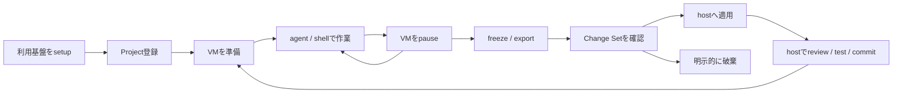

# sunaba 利用ワークフロー

この文書では、「何をしたいか」からsunabaの操作を選べるように、代表的な作業の流れを説明します。動作環境、導入、設定項目、各機能の詳細は[ユーザーガイド](./user-guide.md)を参照してください。

以下の例は、build後に3つのsunaba binaryがあるdirectoryを`PATH`へ追加するか、3つとも既存の`PATH`上へ配置し、`sunaba help`を実行できる状態を前提にします。また、macOS側へ固定versionのOpenCodeをインストールし、`opencode --version`を実行できる必要があります。VM側のOpenCode serverはsunabaがAgent imageへ組み込むため、利用者によるインストールは不要です。対象Projectだけを環境変数へ設定します。

```sh
PROJECT=/path/to/project
```

## 全体の流れ

secure modeの通常作業は、VM内で編集し、明示的にexportしてからホストへ適用する流れです。



覚えておくとよい境界は次の3点です。

1. `agent`を終了しても、secure modeのVM内にある編集状態は保持されます。
2. `changes export`を実行するまで、VM内の編集はホスト作業ツリーへ現れません。
3. `changes apply`でhost生成nonceを確認するまで、Change Setはホストへ反映されません。

## 初めてのプロジェクト

### 1. 利用基盤をsetupする

[ユーザーガイドの「利用前の準備」](./user-guide.md#利用前の準備)に従ってApple Container、OpenCode、sunabaを用意し、OpenAI credentialを登録します。

最初にApple Container、macOS側OpenCode、Agent image、適用済みversion lockを検証・作成します。

```sh
container system version
opencode --version
sunaba setup
sunaba versions show
```

その後、OAuthを使う場合:

```sh
sunaba credentials openai oauth status
```

API keyを使う場合:

```sh
sunaba credentials openai api-key status
```

### 2. Projectを登録する

OAuthは新規Projectの既定です。

```sh
(
  cd "$PROJECT"
  sunaba project init
)
```

従量課金API keyを使う場合は認証方式を明示します。

```sh
sunaba project init "$PROJECT" --model-auth api-key
```

### 3. 設定を確認する

最初はsecure modeのまま利用することを推奨します。必要なmodel、Git remote、Web access、resource上限を対話ウィザードで確認できます。

```sh
sunaba config edit --dir "$PROJECT"
sunaba config show --effective --dir "$PROJECT"
```

Git GatewayやWeb Gatewayが不要なら、有効にする必要はありません。一般Web通信はsecure modeでは既定で無効です。

### 4. VMを準備してOpenCodeを起動する

```sh
sunaba snapshot preview --dir "$PROJECT"
sunaba snapshot approve --dir "$PROJECT" --digest <表示されたdigest>
sunaba up --dir "$PROJECT"
sunaba agent --dir "$PROJECT"
```

previewは内容を表示せず、件数、容量、大容量file、秘密らしいfile名とdigestを表示します。必要ならhost-onlyな`snapshot.exclude`を直して`config apply`し、再previewします。`up`は承認された同一digestのhost ProjectからSnapshotとVMを作成し、分離とresourceを検証してpauseします。`agent`はそのVMを再開し、ホストのOpenCode TUIをVM内serverへ接続します。

TUIを終了するとsession用Gatewayとrelayが失効し、VMは再びpauseします。まだhost Projectに変更はありません。

### 5. 成果物をhostへ反映する

```sh
sunaba changes export --dir "$PROJECT"
sunaba changes review --dir "$PROJECT"
sunaba changes apply --dir "$PROJECT"
```

export後、reviewで変更内容、mode、symlinkと、binary・巨大file等の未表示警告を確認します。applyは同じChange Setを再表示し、Trusted Approval UIに表示されたnonceを手入力した場合だけhostへ反映します。

適用後、ホスト側で通常のreviewとtestを行います。

```sh
git -C "$PROJECT" status --short
git -C "$PROJECT" diff
```

VM内の`.git/`はChange Setに含まれません。host repositoryへcommitする場合は、apply後にホスト側で行います。

## 日常のsecure mode作業

作業を始める前に状態を確認します。

```sh
sunaba status --dir "$PROJECT"
```

既存VMがpausedで、session期限内ならそのまま再開できます。

```sh
sunaba agent --dir "$PROJECT"
```

短いcommandで状態を確認したいときはsanitized shellを使います。

```sh
sunaba shell --dir "$PROJECT"
```

作業途中でTUIやshellを終了しても、すぐにexportする必要はありません。secure modeのVMはnetworkとsession capabilityを失ったpaused状態で、隔離された編集内容を保持します。次回の`agent`または`shell`で続きを行えます。

成果物をhostでreviewしたい段階になったら、exportとapplyへ進みます。

```sh
sunaba changes export --dir "$PROJECT"
sunaba changes review --dir "$PROJECT"
sunaba changes apply --dir "$PROJECT"
```

export後はVMが破棄されます。次の作業は、apply済みのhost Projectから新しいSnapshotを作って開始します。

```sh
sunaba up --dir "$PROJECT"
sunaba agent --dir "$PROJECT"
```

## OpenCode v1を更新する

まず、全Projectの隔離中の作業をexportするか破棄し、SupervisorとVMを終了します。export済みのpending Change Setはhost-only領域に保持できます。

```sh
sunaba project list --active
```

特定versionへ更新する場合:

```sh
printf 'OpenCode v1 exact version: '
read -r OPENCODE_VERSION
sunaba versions set "$OPENCODE_VERSION"
sunaba update check
```

確認時点の最新stable v1を選ぶ場合:

```sh
sunaba versions track v1-stable
sunaba update check
```

`update check`は候補のexact version、公式artifact、source commit、digestを確認してhost quarantineへ保存するだけで、現在の実行環境を変更しません。出力されたexact versionと同じOpenCodeをmacOSへインストールします。

```sh
opencode --version
```

macOS側のversionを確認後、保存済み候補を明示適用します。

```sh
sunaba update apply
sunaba versions show
```

applyは同じversionのguest Agent imageを再buildし、すべてのProject policyとglobal lockをまとめて切り替えます。`agent`や`up`の実行だけでupdateされることはありません。apply後、pending Change SetがあるProjectは通常どおり確認・適用できます。

## Change Setを適用せず破棄する

exportした結果をhostへ反映しない場合、pending Change Setを明示的に破棄してcleanな次回sessionへ移ります。この操作でpending成果物は復元できなくなります。

```sh
sunaba recreate --dir "$PROJECT" --discard-pending
```

その後の`up`または`agent`は、現在のhost Projectから新しいSnapshotを作ります。

```sh
sunaba up --dir "$PROJECT"
```

## Project設定を変更する

設定はactiveまたはpaused VM、pending Change Setがある間は変更できません。まず現在の作業を処理します。

成果物を残す場合:

```sh
sunaba changes export --dir "$PROJECT"
sunaba changes review --dir "$PROJECT"
sunaba changes apply --dir "$PROJECT"
```

成果物を破棄する場合:

```sh
sunaba recreate --dir "$PROJECT" --discard-pending
```

状態が空になったら設定を変更します。

```sh
sunaba config edit --dir "$PROJECT"
```

設定fileを直接編集した場合は、検証と差分確認をしてから適用します。

```sh
sunaba config validate --dir "$PROJECT"
sunaba config diff --dir "$PROJECT"
sunaba config apply --dir "$PROJECT"
```

適用後に新しいVMを作ります。

```sh
sunaba up --dir "$PROJECT"
```

## secure modeでWebを使う

依存導入、Web検索、ドキュメント取得などが必要な場合は、許可するoriginをhost側で決めてWeb Gatewayを有効にします。既存VMとpending Change Setは先に処理してください。

一般的な開発用originの組み込みpresetにProject固有originを追加する場合:

```sh
sunaba web enable \
  --origin https://docs.example \
  --dir "$PROJECT"
```

機密Projectで、組み込みpresetを使わず必要最小限のoriginだけを許可する場合:

```sh
sunaba web enable \
  --default-origins=false \
  --origin https://packages.example \
  --dir "$PROJECT"
```

設定後にAgent Sessionを開始します。

```sh
sunaba up --dir "$PROJECT"
sunaba agent --dir "$PROJECT"
```

VM内では、OpenCodeのWeb tool、`curl`、`wget`、`apt`など、base imageにある対応toolが明示proxyを利用します。未登録originへの接続は拒否されます。

HTTPSでは、sunabaは許可originと接続先IPを検証しますが、暗号化されたtunnel内部のuploadやside effectを識別できません。sourceや秘密を含むProjectでは、`common-development` presetを安易に有効にせず、必要最小限のoriginだけを許可してください。

blocklistの期限更新は、VMがない状態で行います。

```sh
sunaba web refresh --dir "$PROJECT"
```

## 外部Git履歴を使う

### 1. hostでremoteを登録する

VMとpending Change Setがない状態で、credentialを含まない固定HTTPS `.git` URLを登録します。

```sh
sunaba git remote add \
  --name origin \
  --url https://git.example/team/project.git \
  --dir "$PROJECT"
```

hostのGit credential helperが、このURLのcredentialを非対話で取得できることを確認してください。SSH remote、credential入りURL、Git LFS endpointは利用できません。

### 2. 既定workspaceへhistoryを取得する

`agent`または`shell`を開始すると、sunabaが既定workspaceのguest-local gitdirへ固定Gateway URLをremoteとして設定します。別directoryへcloneせず、このrepositoryへhistoryを取得します。

VM内で実行:

```sh
git fetch origin
git log --oneline --decorate --all -n 20
```

必要なbranchを確認して、既定workspaceへmergeまたはrebaseします。

```sh
git merge --ff-only origin/main
```

fetch、pullにはhost承認は不要です。固定remote、session、quotaの範囲はGatewayが強制します。

互換目的で別directoryへcloneしたrepositoryが残っている場合、dirty working treeまたは未push commitがある間はexportを拒否します。必要なworking fileを既定workspaceへ移し、commitをpushしてからexportしてください。

### 3. pushを承認する

VM内でpushすると、最初の試行はpending approvalを作って拒否されます。

```sh
git push origin HEAD:refs/heads/main
```

Agent Sessionを動かしたまま、別のhost terminalで承認requestを確認します。

```sh
sunaba approvals --dir "$PROJECT"
```

remote、ref、old/new object ID、force/delete、nonceを確認して承認します。その後、VM内で変更を加えずに同じpushを期限内に再実行します。

承認はone-shotです。commit、ref、remote、force/deleteが変わった場合は、新しいrequestを確認してください。OpenCode TUI内の表示だけではhost承認は成立しません。

## 直接Internet接続が必要な作業

Web Gatewayのorigin単位の許可では足りず、任意のpublic Internet接続が必要な場合だけdev modeを選びます。

現在のVMとpending Change Setを処理したあと、dev modeを明示して準備します。

```sh
sunaba up --dir "$PROJECT" --mode dev
sunaba agent --dir "$PROJECT"
```

dev modeでは、foregroundの`agent`または`shell`が動いている間だけ専用networkから直接egressできます。session中の情報流出防止は保証されません。Project内のsource、`.env`、生成物など、VMから読める情報は外部へ送信され得ます。

session終了時、sunabaはegressをdeny-allへ切り替え、VMをexportして破棄します。dev VMをbackgroundで保持しません。同時にactiveにできるdev sessionは1つです。

host worktreeの非mount、host credentialの非注入、host・LAN・private network・他VMへの拒否は維持されます。ただし、VM自身が用意したcredentialによるGit pushなど、直接egress上の外部書き込みをGit Gateway承認で止めることはできません。

## VMに不審な挙動がある

VMは最初からuntrustedとして扱われますが、悪意ある永続化や侵害が疑われる場合は、同じVMを再利用しないでください。

成果物を確認する必要がある場合:

```sh
sunaba changes export --dir "$PROJECT"
```

exportされたChange Setは安全なcodeとは限りません。`sunaba changes review --dir "$PROJECT"`で内容を慎重に確認し、疑わしいscript、dependency、設定をhostで実行しないでください。binaryや巨大file等の内容未表示警告がある場合はsize、digest、導入元を含めて判断します。適用する場合は通常どおり`changes apply`を使います。

成果物を信用せず破棄する場合:

```sh
sunaba recreate --dir "$PROJECT" --discard-pending
```

次回は現在のhost Projectからclean Snapshotを作ります。

```sh
sunaba up --dir "$PROJECT"
```

クリーン再生成はVM内の永続化を引き継ぎません。一方、hostへ既に適用した危険な変更やdependencyの安全性までは回復しないため、host側のreviewと通常のincident responseも行ってください。

## 作業を一時停止する

`agent`または`shell`を終了するとsecure modeのVMは通常pauseされます。明示的に停止状態を確認・強制したい場合は`down`を使います。

```sh
sunaba down --dir "$PROJECT"
sunaba status --dir "$PROJECT"
```

`down`は隔離された書き込み層を保持します。成果物をhostへ取り出す操作ではありません。

## Projectのsunaba管理状態を削除する

まず必要な成果物をexport・applyします。

```sh
sunaba changes export --dir "$PROJECT"
sunaba changes review --dir "$PROJECT"
sunaba changes apply --dir "$PROJECT"
```

その後、sunabaのProject stateとhost-only設定を削除します。

```sh
sunaba destroy --dir "$PROJECT" --yes
```

`destroy`はhost Project自体を削除しません。pendingまたは未exportの変更を破棄する場合だけ、復元できないことを理解したうえで明示します。

```sh
sunaba destroy \
  --dir "$PROJECT" \
  --yes \
  --discard-pending
```

元のProject directoryが失われている場合は、`project list`に表示された完全な12桁のIDを使います。

```sh
sunaba project list
sunaba destroy \
  --project-id 0123456789ab \
  --yes \
  --discard-pending
```

## 次に読むもの

- 設定項目やcommandの意味: [ユーザーガイド](./user-guide.md)
- secure/dev、Gateway、Change Setの保証範囲: [セキュリティ設計・製品仕様](./plan/sunaba-secure-agent-platform.md)
- Apple Containerやpfの限定復旧: [ホスト操作の許可範囲](./plan/allowed-host-operations.md)
